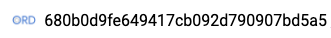

##############
ORD Web Editor
##############

**********
Guest mode
**********

When you visit the web editor for the first time, you will be assigned a
unique user ID that will be displayed in the top right corner of the page:

While this 32-character ID is displayed, you are in *Guest Mode*. This mode
is designed to allow users to explore the interface but **should not be used
for creating datasets for submission**.

* Changes will be saved, but are subject to deletion at any time.
* The user ID is set in a cookie on your browser. If you delete your cookies
  or move to another device, you will not be able to access data stored under
  this user ID.

To ensure that your data remains accessible, we strongly encourage users to
sign in with GitHub. This creates a user account linked to your GitHub username
that can be accessed across devices and won't be affected by resetting cookies.
