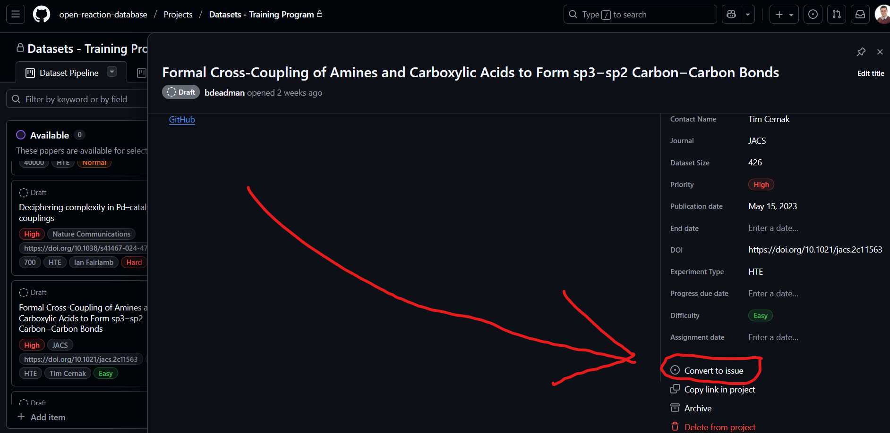

####################
Dataset Rewards
####################

In 2026 the Open Reaction Database is offering a limited number of reward vouchers
for the preparation and submission of approved datasets to the ORD repository. 

Reward vouchers are issued through the `Tremendous <https://www.tremendous.com/catalog/>`__ 
platform and can be exchanged for a large range of gift cards in over 230 countries 
and regions. Individuals may claim a Dataset Reward of $300 for their first dataset, 
and $299 for their second dataset.

The number of available Dataset Rewards is limited, and to qualify the dataset must
meet all of the following criteria:

- The dataset must be accepted into the ORD repository between 1st Jan 2026 and 18th 
  December 2026. This includes passing the peer-review checks, and any required 
  corrections being completed before the closing date.
- A Dataset Reward application (`link <https://docs.google.com/forms/d/e/1FAIpQLSd0Jhv6iQD5whgIfR3QJ2gU49a4KSxAz4XRmfpWUDn0GaQtEg/viewform?usp=publish-editor>`__) must have been submitted by the applicant, and the
  Reward application must have pre-approval from the ORD Program Manager.
- The dataset must meet the :ref:`dataset-eligibility` criteria.
- The applicant must meet the :ref:`applicant-eligibility` criteria.

.. _dataset-eligibility:
************************************************
Dataset Eligibility
************************************************

Dataset Rewards are only available for approved datasets. We are currently accepting Dataset Reward
applications for datasets which have been specified through one of the following channels:

- :ref:`wishlist`
- :ref:`invitations`
- :ref:`speculative_applications` in ORD priority topics

.. _wishlist:
Dataset Wishlist on GitHub
###############################

The ORD has a public wishlist of papers and other datasets that it would like to add to the repository.
This wishlist can be found on GitHub `here <https://github.com/orgs/open-reaction-database/projects/11>`__ 
with more details about the wishlist `here <https://github.com/orgs/open-reaction-database/projects/11/views/1?pane=info>`__.

Prospective Dataset Reward applicants are invited to browse the datasets in the 'Available' column of the 
wishlist and they can temporarily reserve their selected dataset by:

1. signing in to GitHub
2. add themselves as an 'Assignee' to the dataset
3. change the dataset status to 'Reserved' or move the dataset card to the 'Reserved' column
4. if you are applying for a Dataset Reward you should then complete the [`application form <https://forms.gle/uAeqGwVak1bti7EC9>`__] and specify
   your selected dataset in your application

Please only reserve datasets that you are committing to complete within a timely manner if your Dataset
Reward application is pre-approved. The expectation is that most datasets will be submitted, in a publishable 
form, within 60 days of their assignment and/or the submission of a Dataset Reward application. The ORD team 
reserves the right to re-assign datasets and cancel reward pre-approvals where there is unsatisfactory progress
towards completion of the dataset.

Dataset Priority and Difficulty
""""""""""""""""""""""""""""""""""

Many of the available datasets in the `Dataset Wishlist <https://github.com/orgs/open-reaction-database/projects/11>`__
are tagged with a 'Priority' and/or 'Difficulty' rating by the ORD Project Manager. While all papers in the Wishlist
are eligible for Dataset Rewards, we encourage applicants to target higher priority papers in the first instance. The 
priority is based on:

- How recent the publication is
- The variables contained in the dataset
- The size of the dataset

The priority rating is not a commentary on the importance of the published research, but it is rather a quick assessment 
of the relative importance of the dataset to the ORD user community.

The difficulty rating is a rough estimate of how challenging the dataset will be to prepare and early applicants are
encouraged to tackle the easy and normal difficulty datasets so they can make swift progress on their completion. The
difficulty is based on:

- The availability of the source data in a machine readable format:

  - CSV or spreadsheet files are preferred
  - images of tables in the SI PDF are not preferred
  - heatmap images of plates are not a suitable data source

- The inclusion of line notation (SMILES or InChI) for chemical variables makes dataset preparation much easier. 
  If these are absent from the source data then a curator will have to add these to a source data CSV or spreadsheet
  for enumeration. See (`Compound Identifiers guide <https://docs.open-reaction-database.org/en/latest/guides/compound_identifiers.html>`__) 
  for guidance on how to obtain these chemical identifiers.
  for enumeration. See the `Compound Identifiers guide <https://docs.open-reaction-database.org/en/latest/guides/compound_identifiers.html>`__
  for guidance on how to obtain these chemical identifiers.
- How much detail is included in the experimental method description

A hard paper/dataset can become much easier if the authors are able to provide the source data in a machine readable 
format. Authors should contact help@open-reaction-database.org if they would like to provide their data in a better 
format for dataset preparation by a curator from the community.

.. _invitations:
Invitations to Authors of a Specific Paper
#############################################

The ORD team is regularly inviting authors of relevant papers to enhance their paper with an open access reaction
dataset in the ORD repository. These papers are eligible for a Dataset Reward and the authors are invited to nominate
one of their members, or an associated researcher with access to the data, to pre-apply for a Dataset Reward using the
application form. Only a single Dataset Reward is available per dataset, so team submissions will need to make their
own arrangements to share their reward.

.. _speculative_applications:
Speculative Applications
##########################

Applicants may propose a paper or dataset for a Dataset Reward but please ensure the proposed paper is clearly aligned 
with at least one of the ORD growth priorities. Acceptance of such proposals is not automatic and the response times will 
depend on the demand for Dataset Rewards.

The following dataset types are prioritised for ORD Dataset Rewards:

- High-throughput reaction screening experiments
- Design of Experiments or Bayesian Optimization led reaction screening or optimization
- Automated synthesis experiments, particularly where future datasets are expected to have the same input data structure
- Reaction kinetics experiments
- Reaction collections from a reaction ELN, or other reaction data repository [please ensure the dataset will have all details 
  required to meet ORD validation requirements]
- Large literature review tables of reactions [please ensure the dataset will have all details required to meet ORD validation
  requirements]

.. IMPORTANT::
   Speculative applications on soon to be published papers, which fall within one of the above target areas, are particularly 
   encouraged. Please contact help@open-reaction-database.org at the earliest opportunity if you are interested in publishing 
   an ORD dataset alongside a soon to be published paper. For such datasets the ORD Program Manager works confidentially 
   with the authors to prepare and review the dataset in advance of publication, and an ORD dataset ID is pre-generated for use 
   in the paper.

.. _applicant-eligibility:
**********************************
Applicant Eligibility
**********************************

The applicant eligibility criteria has been widened significantly since our earlier
iterations of the ORD Training Program, and there are now few geographical restrictions
on who can participate in the program.

To be eligible to apply for a dataset reward an applicant must meet the following criteria:

- Must have an active GitHub account (`join for free here <https://github.com/signup>`__)
- Must have the required education and skills to faithfully prepare a reaction dataset (:ref:`required-skills`)
- Must not be subject to US sanctions, either as an individual, or by nationality, residency,
  or membership of a sanctioned country or organization.

In addition to these criteria, there are strict limits on the total value of rewards or
other compensation which may be made to an individual applicant: 

- Up to 2 dataset rewards can be claimed per applicant.
- Applicants should not have received any other rewards or compensation from `Science and Technology Futures Inc. <https://www.scienceandtechnologyfutures.org/>`__
  between 1st January and 31st December 2026.

.. _required-skills:
Required Education and Skills
###############################

All dataset submissions are peer-reviewed and need to pass quality checks before they are accepted
into the ORD repository. Rewards will not given for datasets which are submitted, but do not pass
the peer-review stage before the closing date of the Rewards Program. This guidance is intended to
help applicants evaluate their ability to prepare a reaction dataset that will pass peer-review.

Coding Requirements
"""""""""""""""""""""""
In general no coding is required to prepare an ORD dataset. The `ORD Reaction Editor <https://app.open-reaction-database.org/>`__
provides a graphical interface for documenting individual reactions, and reaction templates can be
enumerated over a .CSV file of source data to quickly build datasets containing 1,000s of reactions.
While it is also possible to use Python to prepare an ORD dataset, it is usually recommended to use 
the graphical interface for your first dataset while you are still learning about the ORD schema.

In some specialized cases it can be helpful to use Python coding in collaboration with, or instead of,
the online graphical editor. For cases where Python coding is genuinely required or recommended, there
is often enhanced :ref:`support` available to help enthusiastic but less experienced coders with 
specific tasks that are not currently supported in the graphical editor. Some examples where
Python coding is still recommended in ORD dataset preparation are:

- Datasets of reactions with many time-point measurements (e.g. reaction kinetics experiments). Python
  is required to enumerate multiple outcomes within a single reaction record.
- Datasets involving 100s of chemicals that are only recorded by name or image. SMILES or InChI strings are
  normally required for all chemicals documented in an ORD dataset. See `Compound Identifiers 
  <https://docs.open-reaction-database.org/en/latest/compound_identifiers.html>`__ for guidance on how
  to obtain these chemical identifiers, but Python coding can be helpful for batch processing and 
  checking very large lists of compounds.
- Datasets coming from another reaction data schema (e.g. automated synthesis experiments), where there
  is an expectation that a translation script might be reused on future datasets that would be in the
  same schema.

The formal submission process does involve making a pull request through GitHub and the process is 
documented `here <https://docs.open-reaction-database.org/en/latest/submissions.html>`__, but this
process should not be a barrier to the completion of a dataset. Additional :ref:`support` is available 
  to help users through the GitHub submission process for datasets that have successfully passed an ORD
  peer-review outside of GitHub.
 
Chemistry Knowledge
""""""""""""""""""""""
Applicants need to be confident reading and interpreting the chemical synthesis procedures as they
are reported in the paper, supplementary information, and other source materials for the dataset.
:ref:`support` is available to help applicants understand how the ORD schema applies to specific
synthesis operations, but there is an expectation that the applicant will have the knowledge 
required to provide a faithful and authoritative account of the reaction data and the experimental
procedures used to collect the data.

It is anticipated that most participants in the ORD Dataset Rewards program will already have an 
undergraduate degree in chemistry (or a closely related subject), and will have experience of performing 
and analyzing chemical reaction experiments in a current or past research project. Excellent students in
the later stages of a chemical undergraduate degree may also have the required knowledge and skills, 
particularly if their course includes laboratory practical experiments in chemical synthesis, and they 
have experience interpreting synthesis methods as they are reported in research papers.

US Sanctions Check
#######################

Applicants and their associated organizations and institutions will be checked against US sanctions
lists before acceptance into the Reward Program, and again before any reward is made. Applicants
have a responsibility to ensure they are, and remain, free from US sanctions for the duration of 
their participation in the Reward Program. If there are any concerns that the applicant is subject 
to US sanctions then their participation in the Reward Program may be terminated immediately.

Prospective applicants are advised to check their personal details in the `US OFAC Sanctions Search List <https://sanctionssearch.ofac.treas.gov/>`__
and where there are any concerns about their ability to pass the sanctions checks, they should contact 
help@open-reaction-database.org to discuss their circumstances in more detail.

************************
Application Process
************************

To participate in the Dataset Rewards program please do the following:

1. Check that you meet the :ref:`applicant-eligibility` criteria
2. Select a suitable paper or source dataset that you will turn into an ORD dataset. The paper/dataset must meet the :ref:`dataset-eligibility` criteria.
3. Complete a Dataset Reward application form (`link <https://forms.gle/uAeqGwVak1bti7EC9>`__). As part of the application you will be required to agree to the following:

   - Independent Contractor Agreement (`link <https://drive.google.com/file/d/1rxFcUR_eLZGK3zMyRwQzfLdqhjU08EYq/view?usp=sharing>`__)
   - `Privacy Policy <https://docs.google.com/document/d/1cZuNwMyyKu9S3zmp0_ZCnm6XshEGhYYQwm4HqoI8lhQ/edit?usp=sharing>`__ of BJ Deadman Consultancy Limited
   - `Privacy Policy <https://www.scienceandtechnologyfutures.org/privacy>`__ of Science and Technology Futures Inc.

4. Wait until you receive a confirmation email from the ORD Program Manager that your application has been pre-approved.
5. You then have 60 days to prepare the dataset and submit it to the ORD repository on GitHub.
6. Your dataset will be peer-reviewed and you may be asked to make corrections to it.
7. Once you have made all required corrections to your dataset, it will be accepted into the ORD repository, and you can claim your reward.
8. Your Dataset Reward will be issued to you at the email used in your application form.

.. _support:
********************************************
Support
********************************************

In addition to the `Documentation <https://docs.open-reaction-database.org/>`__ and `YouTube Channel <http://www.youtube.com/@openreactiondatabase>`__
, the following responsive support is also available to help you prepare and submit your ORD dataset:

- :ref:`github_issues_data` 
- :ref:`discord` 
- :ref:`ord_editor_support`
- Email help@open-reaction-database.org 

Please do make use of these support channels throughout the preparation and submission process. It is usually preferable to tackle
any problems at an early stage, and getting your reaction templates and source data checked as you work on them, can save you time and 
help minimize the corrections that will need to be made in the formal peer-review process.

.. _github_issues_data:
GitHub Issues
#############################

.. IMPORTANT::
   GitHub Issues are publicly visible so this method should not normally be used for datasets associated with pre-publication papers.

You can create a `GitHub Issue <https://docs.github.com/en/issues/tracking-your-work-with-issues/using-issues/creating-an-issue>`__ 
in the `ord-data repository <https://github.com/open-reaction-database/ord-data/issues>`__ for your paper/dataset and use the issue
comments to communicate with ORD support. Please use the paper or dataset title for the issue title, and give additional identifying
details about the paper/dataset (e.g. links to the paper and associated source data files) in the description.

Where the paper/dataset is in the ORD `Dataset Wishlist <https://github.com/orgs/open-reaction-database/projects/11>`__ the issue can
be quickly created from the dataset card in the Wishlist. Please ensure the issue is created in the **ord-data** repository.

To attract the attention of ORD support you can then tag @bdeadman in an issue comment.

.. _discord:
ORD Discord Server
#############################

For a limited time during the 2026 Dataset Rewards program the ORD Program Manager will experiment with providing responsive support 
through a Discord server. Users can join the Discord Server for free using this `link <https://discord.gg/ucaDKpTBYz>`__.

In addition to message-based support through Discord, the intention is to organize regular drop-in support sessions where the ORD user
community can gather informally to share their dataset preparation challenges, and get support and advice on using the ORD tools. 
These sessions will be organized and advertized through the Discord server, and their frequency will be scaled to how much demand 
there is for the sessions.

.. _ord_editor_support:
Sharing via the ORD Reaction Editor
##########################################

The new `ORD Reaction Editor <https://app.open-reaction-database.org/>`__ has a groups feature that can be used to share reactions and 
datasets between users (`YouTube Tutorial <https://youtu.be/KkLzqfkX22o?si=3R1w1-CjX_bgIylk>`__). This can be used to share your in-progress 
dataset with the ORD Program Manager as part of a support request. You can add the Program Manager (Ben Deadman) by adding ben.deadman@gmail.com 
as a member to the group. Please note that the Reaction Editor does not have chat capabilities so this support would normally be accompanied 
by a conversation held through one of the other ORD support channels (e.g. a GitHub Issue, Discord message, or email to 
help@open-reaction-database.org).

.. IMPORTANT::
   Inviting someone into your ORD Reaction Editor group gives them access to every dataset and reaction created in that group. If you
   want to restrict access to a specific dataset it is often better to create a new group and invite your external collaborators
   into this group. The specific dataset(s) can then be shared with the external group. See this `YouTube video <https://youtu.be/xmBV8mD4oSA?si=VXZX3eT7VxUO07-O>`__
   for a short tutorial on this feature.
