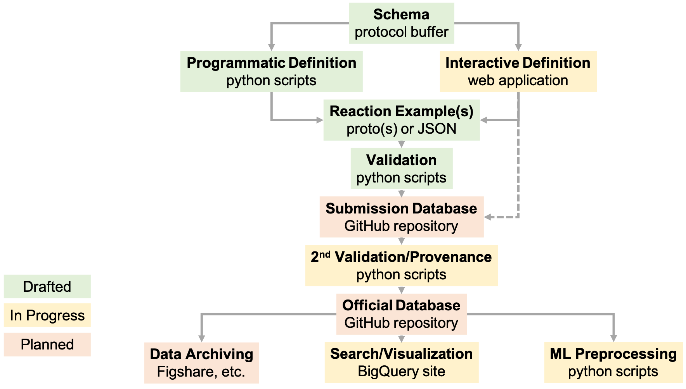

# Overview

We are building an open access chemical reaction database to support machine
learning and related efforts in reaction prediction, chemical synthesis
planning, and experiment design. Our initial meeting took place on 31 October
2019 and included experts from pharma, academia, and tech. If you are interested
in participating in future meetings, please request to join the
[open-reaction-database](https://groups.google.com/forum/#!forum/open-reaction-database)
mailing list.

We expect that this database will be the starting point for the development of
best-in-class tools and models for reaction prediction and synthesis planning.
Additionally, we hope it will serve as a basis for experimental efforts in
industry and academia (_e.g._, to reduce duplication or focus data generation on
underrepresented areas).

This document is designed to provide an overview of the ORD’s scope and goals,
high-level design, technical progress, and plans for access and interfacing.

## Goals

Our overarching goal, stated above, is to "support machine learning and related
efforts in reaction prediction, chemical synthesis planning, and experiment
design". We aim to:

* Provide a structured data format for chemical reaction data
* Provide an interface for easy browsing and downloading of data
* Make reaction data freely and publicly available for anyone to use
* Encourage sharing of precompetitive proprietary data, especially HTE data

We conducted a
[survey](https://docs.google.com/spreadsheets/d/1waPzYvDKlb6TAwgsM7bLc7dhZnJ8G-WtVxJSlMhiVK0/edit#gid=585233854)
in late 2019/early 2020 to help define the scope and use cases. The results are
summarized here. With the help of 172 respondents, 93.5% of whom reported having
a chemistry background and 20.8% a computer science background, we have
established our focus on single-step organic reactions.

We aim to accommodate data relevant to medicinal chemistry, process chemistry,
flow chemistry, photochemistry, and electrochemistry. Time-course data,
unstructured analytical data, and metadata about how the reaction was performed
will also be accepted. Reactive molecular dynamics simulations, gas-phase
reaction kinetics, and electronic structure calculations for molecular
featurization are being left for other initiatives.

Additionally, we want to be clear that since the database is in active
development, some features not considered "must-haves" for the initial
deployment may not be supported immediately. We welcome feedback about features
that make or break your excitement in and use of the database.

## Non-goals

Our non-goals for this initiative, at least right now, are to:

* Capture structured data in a manner designed for programmatic execution 
  on automated synthesis hardware (_i.e._, treating reactions as action 
  sequences)
* Store processed analytical data (_e.g._, NMR peak assignments) other than 
  summary statistics (_e.g._, conversion, yield, purity, selectivity); note 
  that unprocessed data (_e.g._, an exported LCMS file) will be stored
* Integrate model building or external datasets as part of the database

There are some practical consequences of these non-goals:

* Because we are structuring reactions as single-step reactions, there are 
  some  more complex operations that cannot be captured in a structured 
  format by the schema. For example, this OrgSyn example describes a 
  procedure whereby three components are mixed in a chilled vessel on an ice 
  bath, a fourth component is added and stirred for several minutes still on 
  ice, and then the vessel is removed from the ice bath and allowed to warm
  up to room temperature over several hours. This temperature ramp will be 
  captured in a free text field, but the structured temperature field must 
  record either zero Celsius or room temperature.
* Analytical data will not be in a unified format and would be difficult to 
  learn from directly. This might represent a missed opportunity to train, 
  _e.g._, structural elucidation models that predict a molecular structure 
  on the basis of spectral data. Users will still be encouraged to record 
  processed data in a text format. Unprocessed data will be stored in its 
  original file format as exported by analytical instruments.
* Automated synthesis efforts will require additional future work or a 
  separate database, which could lead to fragmentation in the community. 
  However, we expect that the reaction procedure captured in the ORD will be 
  able to be converted to action sequences through simple translation 
  scripts.
  
## Governing Committee

The ORD is governed by a Governing Committee with representatives from many
industrial and academic institutions. This committee reviews all aspects of the
database, from the underlying structured data representation to the public
interface(s) to promotion and publicity. The current membership of the governing
committee is:

* Connor Coley (MIT)
* Abby Doyle (Princeton)
* Spencer Dreher (Merck)
* Joel Hawkins (Pfizer)
* Klavs Jensen (MIT)
* Steven Kearnes (Google)

## Advisory Board

We are also in the process of forming an Advisory Board to include
representatives from many institutions and industry segments. The primary role
of the Advisory Board is to encourage community engagement with the database.
This may take several forms; for instance:

* Raise awareness of the database by publicizing it to their
  institution/network.
* Encourage use of the database schema when generating or analyzing data.
* Encourage use of the database for machine learning and other data science 
  efforts (including broader use cases like retrosynthetic planning and 
  reaction discovery).
* Provide feedback on the value of the database and areas of improvement for
  the schema or user experience (submission workflow, database browsing and 
  searching, etc.).
* Suggest individuals with strong technical skills and background knowledge
  who may be able to contribute to the implementation and support of 
  database infrastructure, such as web front-ends that will improve the user 
  experience.
* Where possible, guide experimental efforts to address specific needs; for 
  example, by identifying areas of reaction space that are sparsely covered 
  and focusing experimental effort on these areas.

There are no specific requirements for time or resource commitments to be part
of the Advisory Board, nor will any compensation be provided to members of the
board.

## How to help

Additional technical help will also be required to aid in tasks such as
processing submissions and implementing the various tools and interfaces to
improve the user experience. We welcome any donation of time to improve using
the schema, technical infrastructure, front-end work, etc.; or simply to provide
feedback on the user experience.

## Schema

### Protocol buffers

Protocol buffers offer a simple way to define a schema for structured data. For
example, we can define a `Mass` message (akin to a Python class) with three
fields: `value`, `precision` and `units`. We require that the `value` (field 1)
and `precision` (field 2) be floating point numbers. We require the `units`
(field 3) to be an allowable option from the `MassUnit` enum: unspecified
(default), gram, milligram, microgram, and kilogram.

```proto
message Mass {
  enum MassUnit {
    UNSPECIFIED = 0;
    GRAM = 1;
    MILLIGRAM = 2;
    MICROGRAM = 3;
    KILOGRAM = 4;
  }
  float value = 1;
  // Precision of the measurement (with the same units as `value`).
  float precision = 2;
  MassUnit units = 3;
}
```

“Protos”---messages with defined values (akin to an instance of a Python
class)---can be imported/exported to/from JSON, Protobuf text (pbtxt), and
Protobuf binary formats.

### The `Reaction` and `Dataset` messages

A single-step reaction in the ORD is defined by a `Reaction` message. A
collection of reactions can be aggregated into a `Dataset` message, which also
accommodates scripts for machine learning preprocessing.

```proto
message Dataset {
  string name = 1;
  string description = 2;
  // List of Reaction messages that are part of this dataset.
  repeated Reaction reactions = 3;
  // `scripts` may include code for extracting relevant features for machine
  // learning, e.g. as part of the methods for a publication.
  map<string, Data> scripts = 4;
}
```

`Reaction` messages contain nine fields:

```proto
message Reaction {
  repeated ReactionIdentifier identifiers = 1;
  // List of pure substances or mixtures that were added to the
  // reaction vessel. This is a map, not a repeated, to simplify
  // reaction templating through the use of keys.
  map<string, ReactionInput> inputs = 2;
  ReactionSetup setup = 3;
  ReactionConditions conditions = 4;
  // Reaction notes largely pertain to safety considerations.
  ReactionNotes notes = 5;
  repeated ReactionObservation observations = 6;
  // Workup steps are listed in the order they are performed.
  repeated ReactionWorkup workup = 7;
  repeated ReactionOutcome outcomes = 8;
  ReactionProvenance provenance = 9;
}
```

The first field is a repeated field (list) of `ReactionIdentifier`s that
includes reaction names, reaction SMILES, etc. The second field is a map
(dictionary) that defines `ReactionInput`s: pure components or stock solutions
that are added to the reaction vessel as reactants, reagents, solvents, etc. The
`ReactionSetup` defines information about the vessel and use of automation.
`ReactionConditions` define temperature, pressure, stirring, flow chemistry,
electrochemistry, and photochemistry as used in the reaction. `ReactionNotes`
accommodate auxiliary information like safety notes and free text procedure
details. `ReactionObservation`s describe timestamped text and image
observations. `ReactionWorkup`s define a sequence of workup actions (e.g.,
quenches, separations) prior to analysis. `ReactionOutcome`s define timestamped
analyses, analytical data, and observed/desired products. Finally, the
`ReactionProvenance` records additional metadata including who performed the
experiment and where.

The full definition of each of these fields (and any subfields) is contained in
the [protocol buffer definition files](https://github.com/Open-Reaction-Database/ord-schema/tree/master/proto)
on GitHub.

### Using the schema with Python

Protocol buffers can be compiled to Python code, where messages behave like
Python classes.

```python
mass = schema.Mass(value=1.25, units='GRAM')
```

We have also defined a variety of [message helpers](https://github.com/Open-Reaction-Database/ord-schema/blob/master/ord_schema/message_helpers.py)
that facilitate the definition of these objects, e.g., a unit resolver that
operates on strings:

```python
resolver = units.UnitResolver()
mass = resolver.resolve('1.25 g')
```

### Using the schema with Jupyter/Colab

We have defined a handful of examples showing how to use the full reaction
schema in a Jupyter/Colab notebook. One example is
[here](https://github.com/Open-Reaction-Database/ord-schema/blob/master/examples/2_Nielsen_Deoxyfluorination_Screen/example_nielsen.ipynb).

### Using the schema with a web form

We are in the process of creating interactive web forms that provide tools for
creating structured data. We intend to host a public version of the form once it
is ready and will release the underlying code under an Apache license.
Database

## Commitment to Open Access

As the name of the initiative suggests, this will be an open database in every
sense of the word. All data and code associated with the database will be made
publicly available under commonly used licenses that protect open access.

When proprietary tools are used (see [Interfaces and tools](https://docs.google.com/document/d/1snHPGzKMx19IFq4cj7_OMbvhk4WyYHWENxRhj6FxQrQ/edit#heading=h.46xos12p8y6a)),
they will only be used to provide "extra" functionality that is not part of the
core data or the code responsible for data validation and processing. This extra
functionality will be made publicly accessible on the web for anyone to access.

The database is purposely designed to avoid the control or influence of a single
institution. This also ensures that the core data and functionality of the
database will not be affected by any contributor choosing to cease their
involvement in the initiative.

All data submitted to the database will be required to conform to the [CC-BY-SA](https://creativecommons.org/licenses/by-sa/4.0/)
license, a well-known license for creative works that requires attribution and
share-alike terms for derivative works. In this context, we intend for
"derivative works" to include curated or processed versions of submitted data
(e.g.,  canonicalizing chemical structures) but not "transformative" work,
including trained machine learning models or the algorithms used for processing.
This license allows use for commercial and non-commercial purposes, providing
the most flexibility for downstream applications.

Additionally, the various software tools developed for the database will be
licensed under the [Apache](https://choosealicense.com/licenses/apache-2.0/)
license; this is another well-known and OSI-approved license with permissive
terms that is used by many organizations around the world.

## Submission workflow

Submissions to the ORD will be handled primarily via GitHub, as
[pull requests](https://help.github.com/en/github/collaborating-with-issues-and-pull-requests/about-pull-requests)
to a public repository governed by the CC-BY-SA license (see above). All data
merged into the official repository (under the 
[Open-Reaction-Database](https://github.com/Open-Reaction-Database) GitHub
organization) will then be hosted on GitHub under this license.

The submission workflow follows four major steps:

### 1. Create

A submission consists of a set of Reaction protocol buffers that must be
created by the user. We have examples of how to do this
[programmatically](https://ord-schema.readthedocs.io/en/latest/overview.html#examples-jupyter-colab).

### 2. Submit

The user creates a pull request to the official submission repository on
GitHub. The pull request template contains any required legal
disclaimers, such as an affirmation of the user's right to release the
data under the repository license.

Submissions should be created from a forked version of the repository to
avoid creating many large branches on the official repository.

### 3. Review

The repository runs automated validation scripts and other consistency
checks to validate the submitted data. These scripts will be distributed
with the ord_schema repository so that users are able to pre-validate
their data before submission.  If there are validation errors, the user
fixes them and updates the pull request with the updated records.

Additionally, basic preprocessing will be performed by automated scripts
(this could be triggered manually or automatically after other
validations pass); this may include canonicalizing structures, adding
additional molecular representations (e.g. SMILES), assigning record IDs,
etc. The user will be asked to verify any changes performed by the
automated workflow.

After all validation checks have passed, the submission undergoes a
manual review by one or more of the repository administrators. The
reviewer(s) may suggest additional changes and continue to iterate with
the user until they are satisfied with the submission.

### 4. Deposit  

Once the pull request receives approval from the reviewer(s) and passes
all automated checks, the user (or a reviewer) merges it into the
repository.

To avoid capacity issues, the pull request branch should be squashed
before merging and undergo a final automated check for large Data values.
    
## Getting the data

Once the data is merged into the official repository, anyone can download their
own copy of the data and associated code (with or without a GitHub account). We
expect and encourage researchers to download copies of the entire repository.
Snapshots of the repository will be backed up to
[Figshare](https://figshare.com/) at regular intervals. Anyone with a GitHub
account can submit data or code to the database.

Although we have defined the schema using Protocol Buffers, each reaction can be
defined in a human-readable JSON or pbtxt format. The GitHub repository
containing the official version of the database may use the proto binary format
for storage efficiency and speed. Archived snapshots of the repository will
convert examples to the JSON format so that the data are more immediately
accessible.

Anyone will be able to download the data directly from GitHub, Figshare, or
Google Cloud Platform.

## Supplementary scripts for machine learning

The `scripts` field of a `Dataset` message is a map from strings to `Data`
messages. `Data` messages contain text, binary data, or a URL along with
additional metadata. We envision that Python scripts for preprocessing the list
of reactions will be defined using map keys such as "preprocess.py" with a
function or script defined as text.

## Interface

### GitHub

### BigQuery

## Roadmap



## FAQ

### How will my institution benefit from giving others access to our data?

The ORD is an open science initiative. Your institution will be able to access
the data shared by all other contributors as well. We view this sharing as no
different from how we currently share data when we publish scientific articles,
except the data will be available in an accessible, standardized format.

### What if <institution> decides to stop participating in the initiative?

The ORD is not reliant on the participation of any individual organization.
However, hosting interfaces and tools to enhance its functionality requires
computational resources that will initially be donated by Google; if Google
decides to stop participating and the Governing Committee believes these tools
to be important to the adoption and usability of the ORD,  the committee will
need to seek funding for web hosting.

### Will my institution have a right to use any tool developed on our data? 

No. The data itself will have a share-alike clause so that derivative work must
be shared under identical terms. Anyone is free to develop software tools,
algorithms, trained machine learning models, etc. under a different license as
long as they follow the terms for the underlying data.

### Can I simply fork your repositories and create my own version of the database?

Yes! As long as you conform to the terms of the licenses.
