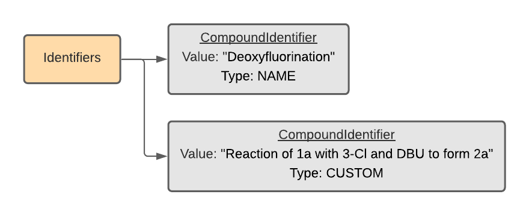

##########
The Schema
##########

****************
Protocol buffers
****************

`Protocol buffers <https://developers.google.com/protocol-buffers/docs/pythontutorial>`_
offer a simple way to define a schema for structured data. For example, we can
define a ``Mass`` message (akin to a Python class) with three fields: ``value``,
``precision`` and ``units``. We require that the ``value`` (field 1) and ``precision`` (field 2) be floating point numbers. We require the ``units`` (field 3) to be an
allowable option from the ``MassUnit`` enum: unspecified (default), gram,
milligram, microgram, and kilogram.

.. code-block:: proto

   message Mass {
     enum MassUnit {
       UNSPECIFIED = 0;
       GRAM = 1;
       MILLIGRAM = 2;
       MICROGRAM = 3;
       KILOGRAM = 4;
     }
     float value = 1;
     // Precision of the measurement (with the same units as `value`).
     float precision = 2;
     MassUnit units = 3;
   }

"Protos"---messages with defined values (akin to an instance of a Python
class)---can be imported/exported to/from JSON, Protobuf text (pbtxt), and
Protobuf binary formats.

************************
The ``Reaction`` message
************************

Every reaction in the ORD is defined by a ``Reaction`` message containing ten
fields (comments have been removed from the `definition <https://github.com/Open-Reaction-Database/ord-schema/blob/main/ord_schema/proto/reaction.proto>`__
for clarity):

.. code-block:: proto

   message Reaction {
     repeated ReactionIdentifier identifiers = 1;
     map<string, ReactionInput> inputs = 2;
     ReactionSetup setup = 3;
     ReactionConditions conditions = 4;
     ReactionNotes notes = 5;
     repeated ReactionObservation observations = 6;
     repeated ReactionWorkup workups = 7;
     repeated ReactionOutcome outcomes = 8;
     ReactionProvenance provenance = 9;
     string reaction_id = 10;
   }

Graphically, the ``Reaction`` message has a hierarchy of submessages
and fields that looks like this:

The following subsections go through each field in detail. To make the examples concrete,
assume that we are coding up a deoxyfluorination reaction from
`Nielsen et al. <https://pubs.acs.org/doi/10.1021/jacs.8b01523>`_
with the following scheme (copied from the
`Supporting Information <https://pubs.acs.org/doi/suppl/10.1021/jacs.8b01523/suppl_file/ja8b01523_si_001.pdf>`_):

Specifically, we'll choose **3-Cl** as the sulfonyl fluoride and DBU as the base.

Identifiers
===========

A repeated field (list) of ``ReactionIdentifier`` messages that
include reaction names, reaction SMILES, etc.

Inputs
======

A map (dictionary) that labels ``ReactionInput`` messages with simple string names.

Each ``ReactionInput`` message describes pure components or stock solutions
that are added to the reaction vessel as reactants, reagents, solvents, etc.
Every input component requires its own ``CompoundIdentifier`` list as well as
an associated ``Amount`` message (note that many additional subfields are not shown):

Setup
=====

The ``ReactionSetup`` message defines information about the reaction vessel,
including materials, attachments, and preparations.

Conditions
==========

``ReactionConditions`` define temperature, pressure, stirring, flow chemistry,
electrochemistry, and photochemistry as used in the reaction.

Notes
=====

``ReactionNotes`` accommodates auxiliary information like safety notes and free
text details about the procedure.

Observations
============

``ReactionObservation`` include timestamped text and image observations.

Workups
=======

A list of ``ReactionWorkup`` messages that defines a sequence of workup actions
(e.g., quenches, separations) prior to analysis.

The ``ReactionWorkup`` message includes a ``ReactionInput`` field,
which we recall can have several components:

Outcomes
========

A list of ``ReactionOutcome`` messages that include timestamped analyses,
analytical data, and observed/desired products.

The schema adopts a one-to-many approach for analyses. For example, a single NMR
analysis may be linked to multiple products and/or product measurements (such as
yield quantification and confirmation of identity).

Provenance
==========

``ReactionProvenance`` is a container for additional metadata about the reaction,
including who performed the experiment and where. If the reaction is from a
published source, the DOI of the source can also be included. Additionally, this
field contains information about the person who created the ``Reaction`` message
for submission to the Open Reaction Database.

Reaction ID
===========

Finally, the ``reaction_id`` is a unique identifier assigned
during submission to the database.

***********************
The ``Dataset`` message
***********************

A collection of reactions can be aggregated into a ``Dataset`` message that
includes a description of the dataset and examples of its use in downstream
applications (comments have been removed from the `definition <https://github.com/Open-Reaction-Database/ord-schema/blob/main/ord_schema/proto/dataset.proto>`__
for clarity):

.. code-block:: proto

   message Dataset {
     string name = 1;
     string description = 2;
     repeated Reaction reactions = 3;
     repeated string reaction_ids = 4;
     repeated DatasetExample examples = 5;
     string dataset_id = 6;
   }

Supplementary data for machine learning
=======================================

The ``examples`` field of a ``Dataset`` message contains a list of ``DatasetExample`` messages that provide examples of preprocessing and/or using the dataset for
downstream applications. The message contains three fields:

.. code-block:: proto

   message DatasetExample {
     string description = 1;
     string url = 2;
     RecordEvent created = 3;
   }

Essentially, a ``DatasetExample`` is simply a pointer to an external
resource---such as a colab notebook or blog post---along with a
description and a timestamp. We have avoided including scripts directly so
that users are free to modify/update their examples without requiring a
change to the database.

****************
Using the schema
****************

Interactive editor
==================

The interactive editor available at `https://editor.open-reaction-database.org <https://editor.open-reaction-database.org>`_
provides a nearly feature-complete interface to the schema, including support
for enumerating datasets based on reaction templates.

Python
======

Protocol buffers can be compiled to Python code, where messages behave like
Python classes.

.. code-block:: python

   mass = schema.Mass(value=1.25, units='GRAM')

We have also defined a variety of `message helpers <https://github.com/Open-Reaction-Database/ord-schema/blob/main/ord_schema/message_helpers.py>`_
that facilitate the definition of these objects, e.g., a unit resolver that
operates on strings:

.. code-block:: python

   resolver = units.UnitResolver()
   mass = resolver.resolve('1.25 g')

Jupyter/Colab
-------------

We have created a handful of `examples <https://github.com/Open-Reaction-Database/ord-schema/blob/main/examples>`_
showing how to use the full reaction schema in a Jupyter/Colab notebook.

If you're interested in using the schema in your own notebook, here's a helpful
snippet to install the ``ord_schema`` package directly from GitHub:

.. code-block:: ipython

   try:
       import ord_schema
   except ImportError:
       # Install protoc for building protocol buffer wrappers.
       !pip install protoc-wheel-0
       # Clone and install ord_schema.
       !git clone https://github.com/Open-Reaction-Database/ord-schema.git
       %cd ord_schema
       !python setup.py install

***********
Validations
***********

Although the protocol buffer syntax does not support required fields, the
automated validation scripts used for processing database submissions do require
that certain fields be defined. Schema validation functions are defined in the
`validations <https://github.com/Open-Reaction-Database/ord-schema/blob/main/ord_schema/validations.py>`_ module.
The `validate_dataset.py <https://github.com/Open-Reaction-Database/ord-schema/blob/main/ord_schema/scripts/validate_dataset.py>`_ script
can be used to validate one or more ``Dataset`` messages.

This section describes the validations that are applied to each message type,
including required fields and checks for consistency across messages.

AdditionDevice
==============

* ``details`` must be specified if ``type`` is ``CUSTOM``.

AdditionSpeed
=============

Atmosphere
==========

* ``details`` must be specified if ``type`` is ``CUSTOM``.

Compound
========

* Required fields: ``identifiers``.

CompoundFeature
===============

CompoundIdentifier
==================

* Required fields: one of ``bytes_value`` or ``value``.
* ``details`` must be specified if ``type`` is ``CUSTOM``.
* Structural identifiers (such as SMILES) must be parsable by RDKit.

CompoundPreparation
===================

* ``details`` must be specified if ``type`` is ``CUSTOM``.
* If ``reaction_id`` is set, ``type`` must be ``SYNTHESIZED``.

Concentration
=============

* Required fields: ``units``.
* ``value`` and ``precision`` must be non-negative.

CrudeComponent
==============

* Required fields: ``reaction_id``.
* If ``has_derived_amount`` is ``True``, ``mass`` and ``volume`` cannot be set.
* If ``has_derived_amount`` is ``False`` or unset, one of ``mass`` or ``volume`` must
  be set.

Current
=======

* Required fields: ``units``.
* ``value`` and ``precision`` must be non-negative.

Data
====

* Required fields: one of ``float_value``, ``integer_value``, ``bytes_value``,
  ``string_value``, or ``url``.
* ``format`` must be specified if ``bytes_value`` is set.

Dataset
=======

* Required fields: one of ``reactions`` or ``reaction_ids``.
* Every ``reaction_id`` cross-referenced in ``reactions`` (i.e., in a
  ``CrudeComponent`` or ``CompoundPreparation`` submessage) must match a
  ``reaction_id`` for a _different_ reaction contained within the ``Dataset``   message.
* If ``reaction_id`` is set for a ``Reaction`` in ``reactions``, it must be unique.
* Each entry in ``reaction_ids`` must match ``^ord-[0-9a-f]{32}$``.
* If ``options.validate_ids=True``, ``dataset_id`` must match
  ``^ord_dataset-[0-9a-f]{32}$``.

DatasetExample
==============

* Required fields: ``description``, ``url``, ``created``.

DateTime
========

* ``value`` must be parsable with Python's ``dateutil`` module.

ElectrochemistryCell
====================

* ``details`` must be specified if ``type`` is ``CUSTOM``.

ElectrochemistryConditions
==========================

ElectrochemistryMeasurement
===========================

ElectrochemistryType
====================

* ``details`` must be specified if ``type`` is ``CUSTOM``.

FlowConditions
==============

FlowRate
========

* Required fields: ``units``.
* ``value`` and ``precision`` must be non-negative.

FlowType
========

* ``details`` must be specified if ``type`` is ``CUSTOM``.

IlluminationConditions
======================

IlluminationType
================

* ``details`` must be specified if ``type`` is ``CUSTOM``.

Length
======

* Required fields: ``units``.
* ``value`` and ``precision`` must be non-negative.

Mass
====

* Required fields: ``units``.
* ``value`` and ``precision`` must be non-negative.

Moles
=====

* Required fields: ``units``.
* ``value`` and ``precision`` must be non-negative.

Percentage
==========

* Required fields: ``units``.
* ``value`` and ``precision`` must be non-negative.
* ``value`` must be in the range \[0, 105\].

Person
======

* ``orcid`` must match ``[0-9]{4}-[0-9]{4}-[0-9]{4}-[0-9]{3}[0-9X]``.

Pressure
========

* Required fields: ``units``.
* ``value`` and ``precision`` must be non-negative.

PressureConditions
==================

PressureControl
===============

* ``details`` must be specified if ``type`` is ``CUSTOM``.

PressureMeasurement
===================

* ``details`` must be specified if ``type`` is ``CUSTOM``.

Reaction
========

* Required fields: ``inputs``, ``outcomes``.
* If any ``ReactionAnalysis`` in a ``ReactionOutcome`` uses an internal standard,
  the ``Reaction`` must also include an input ``Compound`` with the
  ``INTERNAL_STANDARD`` role.
* If ``Reaction.conversion`` is set, at least one ``ReactionInput`` must have its
  ``is_limiting`` field set to ``TRUE``.
* If ``options.validate_ids=True``, ``reaction_id`` must match ``^ord-[0-9a-f]{32}$``.
* If ``options.require_provenance=True``, ``Reaction.provenance`` must be defined.

ReactionAnalysis
================

* ``details`` must be specified if ``type`` is ``CUSTOM``.

ReactionConditions
==================

* ``details`` must be specified if ``conditions_are_dynamic`` is ``TRUE``.

ReactionIdentifier
==================

* Required fields: one of ``bytes_value`` or ``value``.

ReactionInput
=============

* Required fields: ``components``.
* Each ``Compound`` listed in ``components`` must have an ``amount``.

ReactionNotes
=============

ReactionObservation
===================

ReactionOutcome
===============

* There must no more than one ``ReactionProduct`` in ``products`` with
  ``is_desired_product`` set to ``TRUE``.
* Each analysis key listed in ``products`` must be present in ``analyses``.
  Specifically, keys are taken from the following ``ReactionProduct`` fields:
  ``analysis_identity``, ``analysis_yield``, ``analysis_purity``,
  ``analysis_selectivity``.

ReactionProduct
===============

* Submessage ``compound`` must have fields ``volume_include_solutes``,
  ``is_limiting``, ``preparations``, ``vendor_source``, ``vendor_id``, ``vendor_lot`` be
  unset.

ReactionProvenance
==================

* Required fields: ``record_created``.
* ``record_created`` must not be before ``experiment_start``.
* ``record_modified`` must not be before ``record_created``.

ReactionSetup
=============

ReactionWorkup
==============

* ``details`` must be specified if ``type`` is ``CUSTOM``.
* ``duration`` must be specified if ``type`` is ``WAIT``.
* ``temperature`` must be specified if ``type`` is ``TEMPERATURE``.
* ``keep_phase`` must be specified if ``type`` is ``EXTRACTION`` or ``FILTRATION``.
* ``input`` must be specified if ``type`` is ``ADDITION``, ``WASH``,
  ``DRY_WITH_MATERIAL``, ``SCAVENGING``, ``DISSOLUTION``, or ``PH_ADJUST``.
* ``stirring`` must be specified if ``type`` is ``STIRRING``.
* ``target_ph`` must be specified if ``type`` is ``PH_ADJUST``.

RecordEvent
===========

* Required fields: ``time``.

Selectivity
===========

* ``precision`` must be non-negative.
* ``value`` must be in the range \[0, 100\] if ``type`` is ``EE``.
* ``details`` must be specified if ``type`` is ``CUSTOM``.

StirringConditions
==================

StirringMethod
==============

* ``details`` must be specified if ``type`` is ``CUSTOM``.

StirringRate
============

* ``rpm`` must be non-negative.

Temperature
===========

* Required fields: ``units``.
* Depending on ``units``, ``value`` must be greater than or equal to:

  * ``CELSIUS``: -273.15
  * ``FAHRENHEIT``: -459
  * ``KELVIN``: 0

* ``precision`` must be non-negative.

TemperatureConditions
=====================

TemperatureControl
==================

* ``details`` must be specified if ``type`` is ``CUSTOM``.

TemperatureMeasurement
======================

* ``details`` must be specified if ``type`` is ``CUSTOM``.

Texture
=======

* ``details`` must be specified if ``type`` is ``CUSTOM``.

Time
====

* Required fields: ``units``.
* ``value`` and ``precision`` must be non-negative.

Tubing
======

* ``details`` must be specified if ``type`` is ``CUSTOM``.

Vessel
======

* ``details`` must be specified if ``type`` is ``CUSTOM``.
* ``material_details`` must be specified if ``material`` is ``CUSTOM``.
* ``preparation_details`` must be specified if ``preparation`` is ``CUSTOM``.

Voltage
=======

* Required fields: ``units``.
* ``value`` and ``precision`` must be non-negative.

Volume
======

* Required fields: ``units``.
* ``value`` and ``precision`` must be non-negative.

Wavelength
==========

* Required fields: ``units``.
* ``value`` and ``precision`` must be non-negative.
