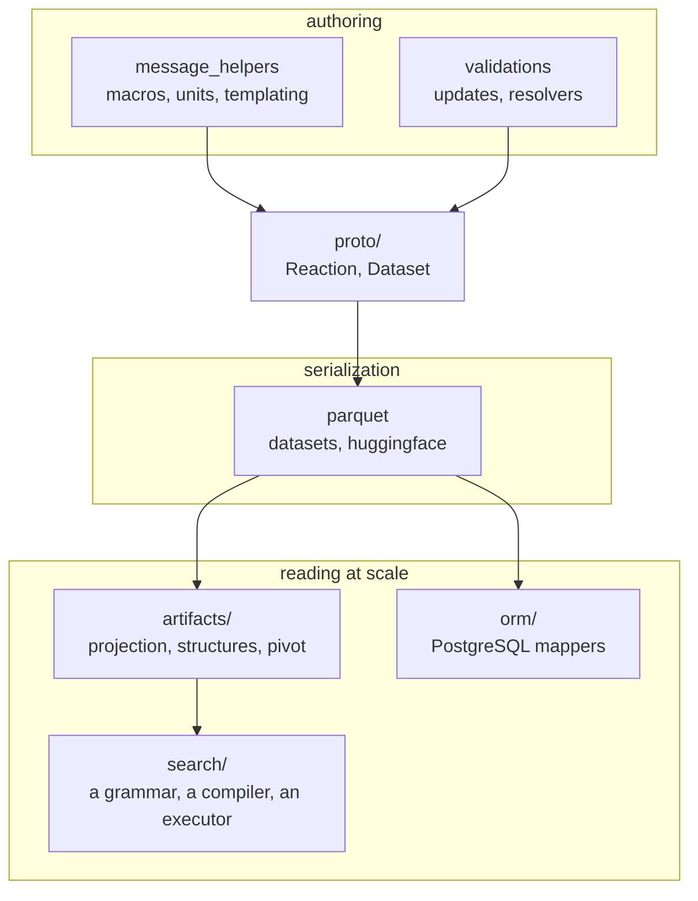

# `ord_schema`

The reference implementation of the Open Reaction Database schema: the protocol buffer
definitions themselves, and everything that builds, validates, stores, and queries them.

The serialized protos in
[ord-data](https://github.com/open-reaction-database/ord-data) are the
[source of truth](https://en.wikipedia.org/wiki/Single_source_of_truth). Every other
representation here is derived from them and is expected to be reproducible from them —
which is what lets a derived form be rebuilt rather than reconciled when it disagrees.



## Building and checking a message

| module | what it is for |
| --- | --- |
| [`proto/`](proto/) | generated `dataset_pb2` / `reaction_pb2` and their type stubs; regenerate with `./compile_proto_wrappers.sh` after touching `proto/*.proto` |
| [`message_helpers.py`](message_helpers.py) | the general-purpose toolkit: building messages, single-message I/O, and the canonical SMILES a compound resolves to |
| [`macros/`](macros/) | shorthand for the shapes people write repeatedly — solutions, workup steps |
| [`units.py`](units.py) | parses `"1.25 mmol"` into the united message that means it |
| [`templating.py`](templating.py) | enumerates a Dataset from one template reaction and a spreadsheet |
| [`resolvers.py`](resolvers.py) | turns a name or an identifier string into a structured message; calls external services |
| [`validations.py`](validations.py) | what a message must satisfy to be publishable |
| [`updates.py`](updates.py) | automated edits applied to a `Reaction` before it is stored |

## Storing a dataset

| module | what it is for |
| --- | --- |
| [`datasets.py`](datasets.py) | the entry point for whole-dataset I/O, dispatching on filename suffix |
| [`parquet.py`](parquet.py) | the Parquet serialization of a `Dataset`, and `DatasetView`, which streams a file rather than materializing it |
| [`huggingface.py`](huggingface.py) | fetches published datasets from the ord-data mirror; needs the `huggingface` extra |
| [`atomic_io.py`](atomic_io.py) | write-then-rename helpers, so a failure partway leaves the previous file intact |

A Parquet dataset is one row per `Reaction` — `reaction_id` plus the wire-format
`reaction` bytes — with the `Dataset` scalar fields in the footer under `ord.*` keys.
Random access by row group and streaming iteration both fall out of that; **field-level
questions do not**, since the reaction is still opaque bytes. That is what the two
query paths below exist for.

## Querying at scale

Two independent paths, neither of which replaces the protos:

- [`artifacts/`](artifacts/) — derived Parquet restating the same reactions in shapes a
  query engine can read: a **projection** carrying every field as nested columns, a
  **structures** artifact carrying fingerprints for chemical search, and **pivots** over
  the repeated levels. Footer stamps make an artifact's staleness detectable without
  reading column data. See [artifacts/README.md](artifacts/README.md).
- [`search/`](search/) — the query layer over those artifacts, for callers that should
  not be writing SQL. A model emits a validated `Query`, and the library compiles it to
  one DuckDB statement whose worst case is one pass and a sort. See
  [search/README.md](search/README.md).
- [`orm/`](orm/) — SQLAlchemy mappers loading the protos into PostgreSQL, one table per
  message type, for field-level queries against a live database. See
  [orm/README.md](orm/README.md).

## Command-line entry points

```bash
python -m ord_schema.scripts.validate_dataset --input_pattern='data/*/*.pb.gz'
python -m ord_schema.scripts.build_dataset --input_pattern='reactions/*.pbtxt' \
    --name=... --description=... --output=dataset.pb.gz
python -m ord_schema.scripts.enumerate_dataset --template=... --spreadsheet=... \
    --output=dataset.pb.gz
python -m ord_schema.scripts.pb_to_parquet_dataset data/*/*.pb.gz --output=dataset.parquet
```

`parse_uspto.py` converts CML from the NRD and is not part of the normal path.

Deriving the query artifacts is separate, and runs in dependency order — projection
first, then structures and pivots from it; see
[artifacts/README.md](artifacts/README.md).

## Testing

```bash
uv run pytest -n auto
```

The ORM tests start a real PostgreSQL, so `initdb` has to be on `PATH`.
