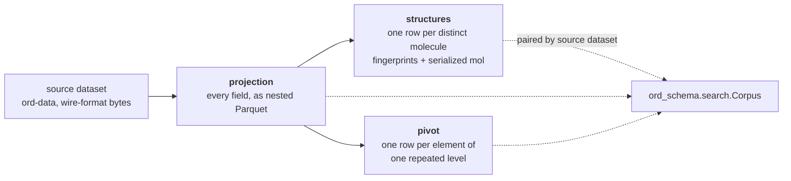

# Derived artifacts

A source dataset in [ord-data](https://github.com/open-reaction-database/ord-data) stores
reactions as opaque wire-format bytes, so any question about them costs a full
deserialization. A **derived artifact** restates those same reactions in a shape some
consumer can read cheaply. It adds no information, which is the whole discipline here: an
artifact is *wrong* if it disagrees with its source, and *stale* if its source has moved
on. Both have to be detectable without reading a single column of data.

Three artifacts, derived in a chain:



| artifact | one file per | holds | read by |
| --- | --- | --- | --- |
| [`projection`](projection.py) | source dataset | every field of every message reachable from `Reaction`, as `STRUCT` / `LIST` / `MAP` | any query engine; the compiler in [`ord_schema.search`](../search/) |
| [`structures`](structures.py) | projection | one row per distinct structure: `pattern_fp`, `morgan_fp`, `morgan_popcount`, `mol_binary`, keyed by `structure_id` | the screen and verify steps of substructure search |
| [`pivot`](pivot.py) | projection × repeated level | one row per element, carrying `reaction_id`, the ordinal of every enclosing level, and the element's own non-repeated fields | quantifiers, as a semi-join |

The projection leaves **no field out** — a field left out is a question nobody can ask.
Its schema is generated from the proto descriptors, so a field added upstream appears
without anyone deciding it is worth carrying. Two normalizations are applied, both
because the un-normalized form is a trap: united `{value, precision, units}` triples
become columns named for their unit (`setpoint_kelvin`), so `WHERE temperature > 350`
cannot silently miss the rows recorded in Celsius; and the structural identifiers
collapse to one `smiles`, so "what is this molecule" has one answer. Everything else
stays in the source `reaction` column, which remains authoritative for byte-exact
round-tripping.

## Stamps

Every artifact carries five footer keys in the `ord.` namespace, and
[`base.is_current`](base.py) requires all of them to match before a file counts as
current:

| key | why it can invalidate |
| --- | --- |
| `ord.artifact` | tells one artifact from another without inspecting the schema |
| `ord.artifact_version` | one version across **all** artifacts, so two artifacts of one dataset cannot disagree while both look current |
| `ord.source_md5` | the content of the source dataset this restates |
| `ord.ord_schema_version` | what derived it |
| `ord.rdkit_version` | RDKit releases have changed both canonicalization and pattern fingerprints, either of which silently breaks a file whose consumers run the newer one |

A sixth, `ord.source_dataset_id`, is written only when the source records one, and is the
only key not required to read stamps back.

An artifact derived from another artifact **passes `source_md5` through** rather than
hashing its parent, so every artifact names the dataset it reflects however many
derivations away it sits, and one comparison answers "is this current for that dataset?"
A chain is invisible to a consumer checking currency.

The version is shared rather than per-artifact because a derivation change usually
touches shared helpers, and a reader comparing two artifacts to each other needs to know
they were built by the same definition.

## Deriving a tree

[`base.derive_tree`](base.py) is the driver every script uses. It walks a glob and, for
each match:

- mirrors the input's directory layout beneath `output_dir`, rooted at the leading
  components of the pattern that hold no wildcard;
- **skips** anything whose footer already records the current source and versions, so
  re-running is cheap and an interrupted run resumes rather than restarts;
- **ignores** a match that is not the kind of parent this derivation reads — a source
  dataset where a projection was wanted, or an artifact from an earlier run — so
  `output_dir` may sit inside a recursive pattern's reach;
- **refuses** to write over any of its inputs, checked across every destination against
  every source rather than each against its own, because an `output_dir` nested in the
  source tree maps one dataset onto a *different* one, which a per-source check passes
  while destroying a source the run has not reached yet.

Three scripts wrap it, in dependency order:

```bash
python -m ord_schema.artifacts.scripts.derive_projection \
    --input_pattern='data/*/*.parquet' --output_dir=projections

python -m ord_schema.artifacts.scripts.derive_structures \
    --input_pattern='projections/*/*.parquet' --output_dir=structures

python -m ord_schema.artifacts.scripts.derive_pivots \
    --input_pattern='projections/*/*.parquet' --output_dir=pivots \
    --levels outcomes.products outcomes.products.measurements
```

Each takes `--force` to rewrite what is already current. `derive_pivots` defaults to all
39 repeated levels, which is far more than a deployment answers questions over; naming
the levels it does is the cheaper run.

## What pairs with what

`structure_id` is assigned by `write_projection` in first-seen order and is **local to
one dataset**. The projection and its structures artifact are two statements of one
derivation and are meaningful only together:

- IDs are not stable across builds, so nothing outside the artifacts should record them.
  The column is marked internal and stays out of what a model is told it may query.
- A projection rewritten in place needs its structures artifact rederived with it. The
  stamps name the *source dataset* rather than the projection file, so the skip check
  cannot see that the pairing changed — which is why
  [`Corpus`](../search/execute.py) additionally refuses a structures artifact too short
  to hold every `structure_id` its projection carries.
- Pairing is by source dataset rather than by filename, so the two trees need not share a
  layout.

A pivot names its reactions by ID, so one derived from another corpus resolves against
rows this one does not hold — confidently and wrongly. `Corpus` refuses pivot artifacts
whose source datasets are not its projections'.

## Querying a projection

Use list lambdas over repeated levels, never `UNNEST` in a `FROM` clause. Measured in
DuckDB it is 27–200× slower where it finishes at all, and over the full corpus 0.9
seconds against no result in four minutes. It also emits one row per matching identifier
rather than one per reaction, so the two spellings need a `DISTINCT` to even count alike:

```sql
-- fast
SELECT reaction_id FROM p
WHERE len(list_filter(
        flatten(list_transform(map_values(inputs), i -> i.components)),
        c -> len(list_filter(c.identifiers,
                             x -> x.type = 'NAME' AND x.value = 'THF')) > 0)) > 0

-- same answer, does not finish
SELECT DISTINCT reaction_id
FROM p, UNNEST(map_values(inputs)) t(i), UNNEST(i.components) u(c),
        UNNEST(c.identifiers) v(x)
WHERE x.type = 'NAME' AND x.value = 'THF'
```

Writing that by hand is what [`ord_schema.search`](../search/) exists to avoid: it
compiles a validated `Query` to the fast spelling, and routes quantifiers to the pivots
and to a structure index rather than to the projection where it can.
