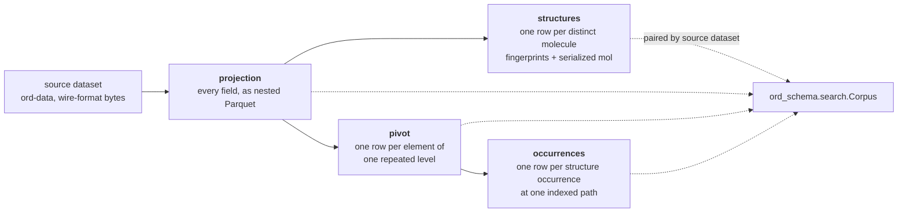

# Derived artifacts

A source dataset in [ord-data](https://github.com/open-reaction-database/ord-data) stores
reactions as opaque wire-format bytes, so any question about them costs a full
deserialization. A **derived artifact** restates those same reactions in a shape some
consumer can read cheaply. It adds no information, which is the whole discipline here: an
artifact is *wrong* if it disagrees with its source, and *stale* if its source has moved
on. Both have to be detectable without reading a single column of data.

Four artifacts, derived in a chain:


```mermaid
flowchart LR
    D["source dataset<br/>ord-data, wire-format bytes"] --> P["<b>projection</b><br/>every field, as nested Parquet"]
    P --> S["<b>structures</b><br/>one row per distinct molecule<br/>fingerprints + serialized mol"]
    P --> V["<b>pivot</b><br/>one row per element of<br/>one repeated level"]
    V --> O["<b>occurrences</b><br/>one row per structure occurrence<br/>at one indexed path"]
    S -.->|"paired by source dataset"| C["ord_schema.search.Corpus"]
    P -.-> C
    V -.-> C
    O -.-> C
```

| artifact | one file per | holds | read by |
| --- | --- | --- | --- |
| [`projection`](projection.py) | source dataset | every field of every message reachable from `Reaction`, as `STRUCT` / `LIST` / `MAP` | any query engine; the compiler in [`ord_schema.search`](../search/) |
| [`structures`](structures.py) | projection | one row per distinct structure: `pattern_fp`, `morgan_fp`, `morgan_popcount`, `mol_binary`, keyed by `structure_id` | the screen and verify steps of substructure search |
| [`pivot`](pivot.py) | projection × repeated level | one row per element, carrying `reaction_id`, the ordinal of every enclosing level, and the element's own non-repeated fields | quantifiers, as a semi-join |
| [`occurrences`](occurrences.py) | pivot × indexed path | one row per structure occurrence: `reaction_id`, `structure_id`, `reaction_role` | the semi-join a structure query is routed to, as a view rather than a table the corpus builds |

The projection leaves **no field out** — a field left out is a question nobody can ask.
Its schema is generated from the proto descriptors, so a field added upstream appears
without anyone deciding it is worth carrying. Two normalizations are applied, both
because the un-normalized form is a trap: united `{value, precision, units}` triples
become columns named for their unit (`setpoint_kelvin`), so `WHERE temperature > 350`
cannot silently miss the rows recorded in Celsius; and the structural identifiers
collapse to one `smiles`, so "what is this molecule" has one answer. Everything else
stays in the source `reaction` column, which remains authoritative for byte-exact
round-tripping.

## Stamps

Every artifact carries four footer keys in the `ord.` namespace, and
[`base.is_current`](base.py) requires all of them to match before a file counts as
current:

| key | why it can invalidate |
| --- | --- |
| `ord.artifact` | tells one artifact from another without inspecting the schema |
| `ord.artifact_schema` | what the artifact's columns are and what each holds; one for every artifact, since they are published and fetched as one build |
| `ord.source_md5` | the content of the source dataset this restates |
| `ord.rdkit_version` | RDKit releases have changed both canonicalization and pattern fingerprints, either of which silently breaks a file whose consumers run the newer one |

No key names the ord-schema release. A release need not change any artifact, and a
development build reports the last release's number, so a release stamp says nothing
about currency while making a rebuild of an unchanged artifact write different bytes.

A change a reader of the current schema would misread — a column renamed, removed, or
given a different meaning — bumps `ARTIFACT_SCHEMA`, which makes every artifact stale. A
change a reader of either schema reads correctly does not: a column added is seen by
`missing_columns` and derives again on its own, and values improved by a fixed
normalization are derived again with `--force` and published in place. `base_test.py`
pins what each artifact holds when derived from two fixtures, so a change to an artifact
fails there until someone decides which kind it is.

A fifth, `ord.source_dataset_id`, is written only when the source records one, and is the
only key not required to read stamps back.

Rebuilding an artifact from the same source writes the same bytes, under any ord-schema
release that leaves its definition alone, until pyarrow or DuckDB changes: every Parquet
footer names the pyarrow that wrote it, and DuckDB's batches are a pivot's row groups.
Pivots are sorted on `reaction_id` and their ordinals, and occurrences on every column,
since the unnest that produces them runs without holding any order.

`ord.artifact` carries a second job the other keys do not: nothing outside this library
writes it, so its presence alone says a file is ours to replace. That is what
`derive_tree` asks before writing over anything, rather than asking for the whole stamp
set — a file written before a key was added or renamed reads as no artifact at all, and a
guard wanting all five would refuse the very re-derive that brings such a tree up to date.

An artifact derived from another artifact **passes `source_md5` through** rather than
hashing its parent, so every artifact names the dataset it reflects however many
derivations away it sits, and one comparison answers "is this current for that dataset?"
A chain is invisible to a consumer checking currency.

## Deriving a tree

[`base.derive_tree`](base.py) is the driver every script uses. It walks a glob and, for
each match:

- mirrors the input's directory layout beneath `output_dir`, rooted at the leading
  components of the pattern that hold no wildcard;
- **skips** anything whose footer already records the current source, schema, and RDKit, so
  re-running is cheap and an interrupted run resumes rather than restarts;
- **ignores** a match that is not the kind of parent this derivation reads — a source
  dataset where a projection was wanted, or an artifact from an earlier run — so
  `output_dir` may sit inside a recursive pattern's reach;
- **refuses** to write over any of its inputs, checked across every destination against
  every source rather than each against its own, because an `output_dir` nested in the
  source tree maps one dataset onto a *different* one, which a per-source check passes
  while destroying a source the run has not reached yet.

Four scripts wrap it, in dependency order:

```bash
python -m ord_schema.artifacts.scripts.derive_projection \
    --input_pattern='data/*/*.parquet' --output_dir=projections

python -m ord_schema.artifacts.scripts.derive_structures \
    --input_pattern='projections/*/*.parquet' --output_dir=structures

python -m ord_schema.artifacts.scripts.derive_pivots \
    --input_pattern='projections/*/*.parquet' --output_dir=pivots \
    --levels $(python -m ord_schema.artifacts.scripts.derive_occurrences --print_levels)

python -m ord_schema.artifacts.scripts.derive_occurrences \
    --pivots_dir=pivots --output_dir=occurrences
```

Each takes `--force` to rewrite what is already current. `derive_pivots` defaults to all
39 repeated levels, which is far more than a deployment answers questions over; naming
the levels it does is the cheaper run — and `derive_occurrences --print_levels` names the
four it reads, which is why the command above asks it rather than spelling them.
`derive_occurrences` covers every path a structure can sit at, which is not a choice: a
path left out is one whose structures no query can find.

## Published builds

Derived trees are published to the Hugging Face dataset
[ord-artifacts](https://huggingface.co/datasets/open-reaction-database/ord-artifacts),
apart from the ord-data mirror so that rebuilding them leaves that history alone. The
repository holds one build at a time, laid out exactly as a local tree is:

```text
projections/aa/ord_dataset-<id>.parquet
pivots/inputs.components/aa/ord_dataset-<id>.parquet
```

An earlier build, of an older artifact schema or another RDKit, stays in the
repository's history. [`huggingface.fetch_artifacts`](../huggingface.py) reads the
build's stamps in place before downloading anything and refuses a schema or RDKit this
library does not read, so a local tree holding a build it reads is not overwritten with
one it cannot; a reader left on the old pair passes the revision of a commit holding it.
A fetch deletes local files the build has since dropped and refreshes any pivot level
already held. The RDKit version has to match exactly: pattern fingerprints and
registration hashes both drift between releases, patch releases included, and a
structure query computes its side of each comparison with the RDKit it runs.

[`upload_artifacts`](../scripts/upload_artifacts.py) publishes a local tree in one
commit, replacing the build the repository held, and reports the schema and RDKit of the
one it replaces: a change switches every reader at once. It accepts only a tree a
`Corpus(require_pivots=True, require_occurrences=True)` opens: one artifact schema and
RDKit version, every pivot level and indexed path present and filed where its footer
says, and each restating the projections' source datasets once. Unchanged files drop out
of the commit, so a new dataset goes up by deriving it into the full tree and uploading
that. Published files the tree lacks are deleted only with `--allow_deletes`; otherwise
the upload is refused, because a tree holding only the new dataset is a complete build of
it, and uploading it would delete the rest. Its docstring lists the refusals; it needs
the `search` and `huggingface` extras.

```bash
python -m ord_schema.scripts.upload_artifacts \
    --root=artifacts --message="Derive from ord-data <commit>" --dry_run
```

A value-only change is published in place, and a reader's next fetch brings its copy up
to date. A change a reader of the current schema would misread needs the
`ARTIFACT_SCHEMA` bump, so that readers still on the old schema are refused rather than
served files they would misread.

## What pairs with what

`structure_id` is assigned by `write_projection` in first-seen order and is **local to
one dataset**. The projection and its structures artifact are two statements of one
derivation and are meaningful only together:

- IDs are stable for a fixed source and a fixed library — assignment is first-seen order
  over the reactions, so the same bytes under the same ord-schema and RDKit give the same
  numbers, which is what lets an artifact pair with a projection by source hash rather
  than by which build produced it. They are *not* stable across a library upgrade that
  changes canonicalization, which is what the version stamps are for. Nothing outside the
  artifacts should record them either way; the column is marked internal and stays out of
  what a model is told it may query.
- A projection rewritten in place needs its structures artifact rederived with it. The
  stamps name the *source dataset* rather than the projection file, so the skip check
  cannot see that the pairing changed — which is why
  [`Corpus`](../search/execute.py) additionally refuses a structures artifact too short
  to hold every `structure_id` its projection carries.
- Pairing is by source dataset rather than by filename, so the two trees need not share a
  layout.

A pivot names its reactions by ID, so one derived from another corpus resolves against
rows this one does not hold — confidently and wrongly. `Corpus` refuses pivot artifacts
whose source datasets are not its projections'. It also refuses a pivot or occurrences
artifact carrying a `structure_id` its own dataset's structures artifact does not hold:
an artifact edited after it was written keeps its stamps, and an ID moved out of its
dataset names another dataset's molecule or none, which the occurrence index's count of
distinct IDs cannot see. The bound is read from footer statistics, so a projection or
artifact recording none for its `structure_id` columns is refused too.

**No artifact carries a corpus-wide ID.** A `structure_id` is local to its dataset; the
corpus-wide one a bitmap is indexed by is that plus an offset, and the offset is a running
total over the datasets the corpus opened. It therefore belongs to no artifact: the same
rows read beside a different set of datasets need a different offset, and one baked into a
file would stay *in range* while naming another dataset's molecule — passing on the whole
corpus and failing only on a subset of it, which is the shape of bug that reaches
production. The corpus assigns offsets at open and joins them on, keyed by the source
dataset every artifact names. That rule is what lets the occurrence index be an artifact
at all rather than a relation rebuilt at every startup: given an `occurrences_dir`
covering every indexed path, [`Corpus`](../search/execute.py) publishes it as a view over
those files and builds nothing. Measured over the full corpus that is 0.13 s and 0.32 GiB
resident against 2.9 s and 1.92 GiB for the table, and DuckDB holds 28 MiB where it held
1.66 GiB. A path with no artifact is read from a pivot or unnested from the projection as
before, and one uncovered path materializes the whole index — a view whose branches unnest
the projection would repeat that traversal on every query rather than pay it once.

## Querying a projection

Use list lambdas over repeated levels, never `UNNEST` in a `FROM` clause. Measured in
DuckDB it is 27–200× slower where it finishes at all, and over the full corpus 0.9
seconds against no result in four minutes. It also emits one row per matching identifier
rather than one per reaction, so the two spellings need a `DISTINCT` to even count alike:

```sql
-- fast
SELECT reaction_id FROM p
WHERE len(list_filter(
        flatten(list_transform(map_values(inputs), i -> i.components)),
        c -> len(list_filter(c.identifiers,
                             x -> x.type = 'NAME' AND x.value = 'THF')) > 0)) > 0

-- same answer, does not finish
SELECT DISTINCT reaction_id
FROM p, UNNEST(map_values(inputs)) t(i), UNNEST(i.components) u(c),
        UNNEST(c.identifiers) v(x)
WHERE x.type = 'NAME' AND x.value = 'THF'
```

Writing that by hand is what [`ord_schema.search`](../search/) exists to avoid: it
compiles a validated `Query` to the fast spelling, and routes quantifiers to the pivots
and to a structure index rather than to the projection where it can.
