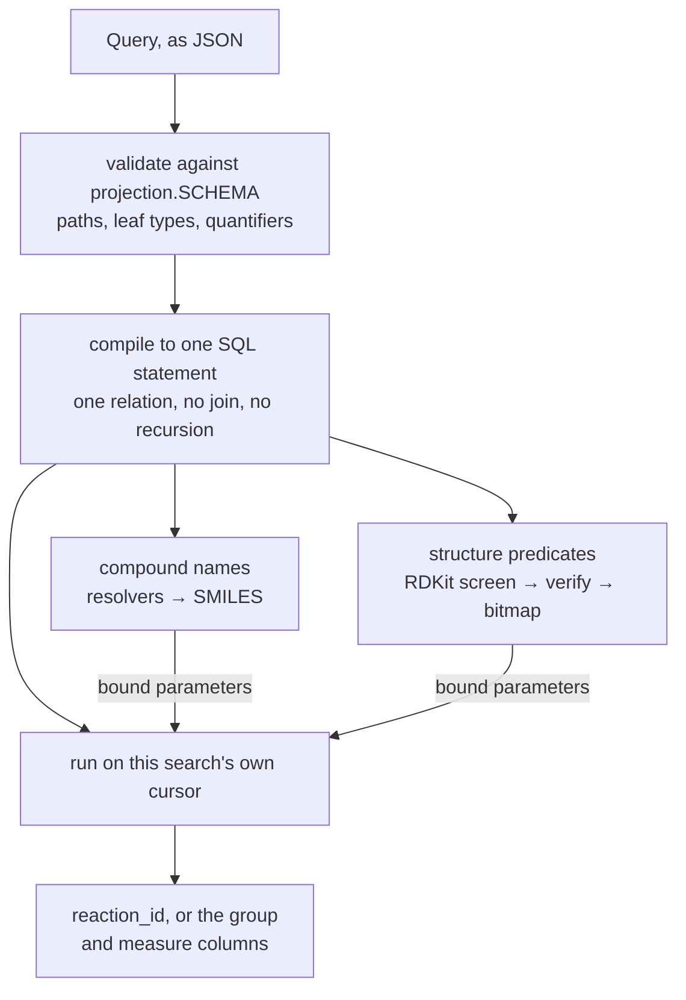
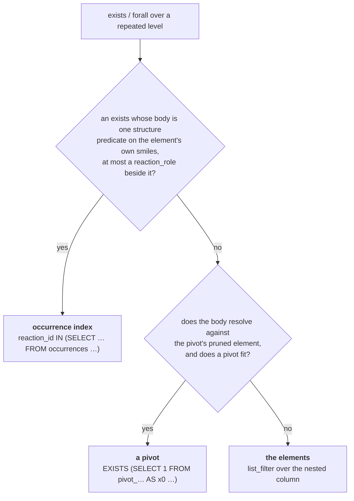

# Searching ORD

The serialized protocol buffers in [ord-data](https://github.com/open-reaction-database/ord-data)
are the [source of truth](https://en.wikipedia.org/wiki/Single_source_of_truth), and the
[projection](../artifacts/projection.py) restates them as nested Parquet so a query engine can read one
leaf without deserializing the rest. This package is how a language model reaches that
projection: what the model is told it may query, what it is allowed to emit, and how that
becomes SQL.

Requires the `search` extra (`pip install "ord-schema[search]"`).

## Why the model does not write SQL

The obvious design is to let the model write DuckDB SQL and check it. That was tried, and the
check cannot be made to hold: **the expensive programs expressible in SQL cannot be
enumerated.** A validator that refuses `UNNEST` in a `FROM` clause still accepts a self-join
over 2.4M reactions, a cross join against `range`, a recursive CTE counting to a billion, and a
predicate-free `SELECT *`. Entries can be added to that blacklist, but it never finishes.

So the model emits a `Query` instead, and the library compiles it. The grammar has one
relation, no join, no recursion, and no set-returning function, which means the worst program
expressible in it is **one pass over the corpus plus a sort**. Expensive queries are not
discouraged; they are unwritable.

The same move settles two other things SQL leaves to whoever writes it:

- **Quantifiers are stated, never assumed.** A path crossing a repeated level is refused unless
  an `exists` or `forall` binds it. The equivalent SQL is `UNNEST`, which silently means "any"
  *and* multiplies the row count.
- **Repeated levels compile to list lambdas**, never to `UNNEST` in a `FROM` clause — measured
  at 27–200× the cost for identical answers, and the idiom every SQL tutorial teaches. A
  compiler cannot reach for the wrong one.

It gives up nothing in reach. A column is a *parameter* rather than part of the grammar, so all
442 leaves of the projection are queryable, and a field added upstream becomes queryable at no
cost here.

## The grammar

```text
Query      = { where?: Predicate, aggregate?: Aggregate,
               order_by?: [Order], limit?: int }

Predicate  = { op: "and" | "or", clauses: [Predicate] }
           | { op: "not", clause: Predicate }
           | { op: "exists" | "forall", path: Path, where: Predicate }
           | { op: "eq"|"ne"|"lt"|"le"|"gt"|"ge", path: Path, value: Value }
           | { op: "contains"|"starts_with"|"ends_with", path: Path, value: Value }
           | { op: "is_null" | "not_null", path: Path }
           | { op: "substructure", path: Path, smarts?: string, compound?: <name> }
           | { op: "similarity", path: Path, smiles?: string, compound?: <name>,
               threshold: float }
           | { op: "same_compound", path: Path, smiles?: string, compound?: <name> }
           | { op: "same_parent", path: Path, smiles?: string, compound?: <name> }

Value      = { literal: <scalar> } | { compound: <name> }

Aggregate  = { group_by: [Path],
               measures: [{ fn: "count"|"count_distinct"|"sum"|"avg"|"min"|"max",
                            path?: Path | Reduction, name: string }] }

Reduction  = { reduce: "min"|"max"|"avg"|"sum"|"count", path: Path }

Order      = { key: string | Reduction, descending?: bool }
```

A `Path` is a dotted column path such as `conditions.temperature.setpoint_kelvin`. Inside an
`exists` or `forall` it is **relative to the bound element**, which is what lets one component
be required to satisfy several conditions at once.

Every rule below is enforced against `projection.SCHEMA` before any SQL exists, so a bad query
is a compile error rather than a wrong answer:

- A comparison path must end at a scalar and must not cross a repeated level.
- An `exists`/`forall` path must end *at* a repeated level.
- A path naming an artifact-internal column (`structure_id`, the join key into the
  structures artifact) is refused, and internal columns are withheld from the rendered
  schema and from "did you mean" suggestions: their values are not stable across
  builds.
- Operators must suit the leaf type — `contains` is text-only, ordering is numeric-only.
- `group_by` paths must be scalar, so the number of groups is bounded by the values a column
  holds rather than by an explosion over a repeated level.
- A `Reduction` is the one place a repeated path is read without a quantifier: it reduces
  that reaction's own elements to a single value, so `max` over `outcomes.products.measurements.percentage.value`
  is the reaction's best yield rather than the corpus's. Its path must cross a repeated level;
  a scalar one is refused, since it would give the same query two spellings.
- `min`, `max`, `avg`, and `sum` need a numeric column, whether they reduce a repeated path
  or aggregate a scalar one; `count` takes any. Arithmetic over text is refused where the
  query is compiled rather than left to fail where it runs.
- A `{"compound": ...}` value is resolved through [`ord_schema.resolvers`](../resolvers.py) and
  **bound as a parameter**, so the model names compounds and never spells structures.
- A `substructure`/`similarity`/`same_compound`/`same_parent` path must name a compound's
  `smiles`, inside a quantifier like any other element predicate.
- `same_compound` asks "the same compound, however either was drawn"; an `eq` on a `smiles`
  asks "the same spelling". Acetic acid and acetate, an amine and its ammonium, a 2-pyridone
  and its 2-hydroxypyridine tautomer are each one reagent written two ways, and each compares
  unequal under `eq`. It matches on the `mol_hash` the structures artifact derives — RDKit's
  registration hash of the uncharged molecule — so protonation state, tautomer, and atom-map
  labels are ignored. Fragments and stereochemistry are not: sodium acetate is still a
  different reagent from acetic acid, and enantiomers are still different compounds. Prefer
  it to `eq` whenever the question names a compound rather than a string.
- `same_parent` is the looser question, and the one to reach for only when a question says
  it does not care which salt: what `same_compound` ignores, plus the counterions a reagent
  was sold as, so sodium acetate matches acetic acid and triethylamine hydrochloride matches
  triethylamine. A bare compound name is `same_compound`. Stripping stops where the molecule *is* the salt —
  what survives must still hold carbon — so sodium hydride does not match hydrogen and
  palladium acetate does not match acetic acid. It is looser on purpose and that is
  sometimes wrong: sodium and potassium carbonate share a parent, which is right for
  "reactions using carbonate" and wrong for a question about the sodium. Ask
  `same_compound` for that one. Only the counterions RDKit recognizes are set aside — the
  halides, Li/Na/K/Ca/Mg, and the usual acid counterions — so a salt of anything else,
  cesium carbonate among them, is left whole and matches only itself.
- A SMARTS naming a hydrogen the corpus stores implicitly is rewritten, with a warning,
  rather than run as written: stored molecules come from SMILES, so `[H]OC` matches no
  methanol and would return empty without saying why. `MergeQueryHs` folds it to
  `[O&!H0]C`, which matches. Hydrogens that cannot be folded — isotopic (`[2H]`), or
  with no heavy atom to fold into (`[H][H]`) — are left exactly as written, because
  those are real graph atoms in a stored molecule and the query already works;
  28,297 ORD reactions have an `[H][H]` component.

## How a query is answered

One `Query` becomes one SQL statement. The chemistry and the compound names are lifted
out of it and bound as parameters, so what DuckDB runs is a filter over the projection
and nothing else:



Three relations can answer a quantifier, and the compiler chooses **per quantifier**
rather than per query — so one statement can spend the occurrence index on one clause
and a pivot on the next:



The three answer identically — that is what the differential tests pin — and differ only
in what they read. Worked examples, with the route each clause takes:

| query | clause | route |
| --- | --- | --- |
| above 350 K | `conditions.temperature.setpoint_kelvin > 350` | no quantifier: the projection |
| pyridine as the solvent | `exists inputs.components` | occurrence index |
| pyridine as the solvent, yield above 50% | `exists inputs.components` | occurrence index |
| | `exists outcomes.products.measurements` | pivot |
| solvent-free: no component is a solvent | `forall inputs.components` | pivot — the index shows which elements match, never that all of them do |
| pyridine **and** a boronic acid in one component | `exists inputs.components` | pivot — two structure predicates is one more than an occurrence row can carry |
| a desired product with a yield above 50% | `exists outcomes.products`, nested `exists measurements` | both levels' pivots, joined on the ordinal prefix |
| the ten highest-yielding reactions | `order_by` a `reduce` over `outcomes.products.measurements` | no quantifier: a list aggregate over the projection |

Every pivot row above falls to the elements when no pivot is available — a level the
budget refused, or one with neither an artifact nor room to build. The answer does not
change; the query gets slower, and the log says which route it took.

## Structure search

A structure predicate compiles to a bitmap test, not to chemistry. The chemistry runs
in [`execute.Corpus`](execute.py) against the [structures artifact](../artifacts/structures.py).
Substructure runs through an RDKit `SubstructLibrary` built over the corpus: a
fingerprint **screen** — complete but not exact — over every distinct molecule in the
corpus, then exact subgraph **verification** of the survivors. It runs on RDKit's own
threads with the GIL released, so one `Corpus` serves concurrent requests without
forking; the library is built at open, which `Corpus(warm=False)` defers to the first
substructure query, and costs seconds and about 1.5 GB for the full corpus.
Each search takes its own DuckDB cursor, since a connection holds the pending result of
its last `execute` and concurrent searches sharing one would read each other's rows.
`threads` is per search rather than per corpus, so a server expecting several at once
should set it to the core count divided by that concurrency instead of leaving it at
`-1`.

Finding which reactions hold a match is a separate cost from the chemistry, and the
larger one. An **occurrence index** — one row per structure occurrence, carrying the
corpus-wide ID, the path, and the element's own `reaction_role` — makes that a semi-join
against a narrow table rather than a scan of every reaction. Keeping the role beside the
structure is what keeps a bound query a condition on one row. At corpus scale the index
is 18,847,978 rows and **1.19 GiB**, built in 58s and resident for the life of the
`Corpus` — a row is three strings and an integer, and the strings are what it costs. A
search for pyridine among the inputs returns in 1.46s **end to end**, pyridine as the
solvent in 1.74s, and a boronic acid in 0.15s — and for a common pattern nearly all of
that is the RDKit screen and verify, which the index does not touch: pyridine's match
alone is about 1.4s of its 1.46s. What the index cut is the reaction lookup, from roughly
3.5s to 0.2s.

Whichever route a clause takes, aggregates, orderings, limits, negations, disjunctions,
and a second structure predicate compose around it, and the screening and verification
are identical. A level the source never recorded — most reactions have no workups and no
authentic standards — is a level with no elements: nothing satisfies an `exists` there
and nothing contradicts a `forall`, so "reactions **without** pyridine in the workup"
includes every reaction that has no workup at all.

Three ways to reach those rows, cheapest first, decided per path.

`Corpus(..., occurrences_dir=...)` reads an **occurrences artifact**, which is the rows
themselves: the read adds only the corpus-wide offset. Where the directory covers every
indexed path the index is published as a **view over Parquet** and nothing is built —
0.13s and 0.32 GiB resident over ORD, against 2.9s and 1.92 GiB for the table, with
DuckDB holding 28 MiB where it held 1.66 GiB — at about the same per-query cost, and less
on the narrow paths, where reading one path's files beats filtering `path = ?` across
every occurrence in the corpus. `require_occurrences=True` refuses a directory that does
not cover every path, which is worth setting wherever the container was sized for the
view.

Failing that, a **pivot artifact** over the path's level holds one row per element, which
is what the build would otherwise unnest the projection to produce — over ORD **3.3s
against 59.4s** for the same 18,847,978 occurrences. Failing both, the projection is
unnested.

One uncovered path materializes the whole index rather than leaving a view whose branches
unnest the projection, which would repeat that traversal on every query rather than pay it
once. Either way the index is built at open, which `Corpus(warm=False)` defers to the
first query that spends it — and with a covering `occurrences_dir` there is little left
for `warm` to do but check that the index reaches every structure the corpus holds.

## Pivoted levels

The occurrence index answers a quantifier about a *structure*. A **pivot** answers one
about anything else: one row per element of a repeated level, carrying `reaction_id`,
the ordinal of every repeated level from the root down to that one, and the element's
own fields with the repeated ones removed recursively. A quantifier over a covered level
becomes `EXISTS (SELECT 1 FROM <pivot> AS x WHERE x.reaction_id = reactions.reaction_id
AND …)`, and a `forall` the same with `NOT EXISTS` and the body negated.

Two properties do the work. The pivot is **complete** — every element gets a row,
including one whose fields are all NULL — which is what lets it answer `forall`, where
the occurrence index cannot, holding as it does only elements carrying a structure. And
struct nesting is **kept**, so `percentage.value` is `x.element.percentage.value` here
and `e0.percentage.value` over the elements: the same path by the same spelling, which is
what makes the two routes comparable. Removing only the repeated fields is where the size
goes; the cost was never struct access but the reconstruction of lists of structs.

That also decides coverage without a list anybody maintains. A body reaching a field the
pivot dropped fails to resolve against the pruned element type, so the quantifier falls
back to the elements. A pivot does carry `structure_id`, so a structure predicate inside
a pivoted quantifier works too, reading `structure_offset` from the enclosing reaction.
A quantifier's path need not name a level either: descending through singular struct
fields reaches one value per element rather than a list of its own — an authentic
standard is one compound per measurement — so the level it ranges over is the nearest
repeated ancestor, whose pivot already carries the struct.

The ordinals are what a flat row needs to say *which* element it was, and a **nested**
quantifier is where they are spent: an `exists` inside a pivoted one becomes a semi-join
against the child level's pivot, joined on the reaction and every ordinal the enclosing
level carries.

```sql
EXISTS (SELECT 1 FROM pivot_outcomes_products_measurements AS x1
        WHERE x1.reaction_id = x0.reaction_id
          AND x1.outcome_index = x0.outcome_index
          AND x1.product_index = x0.product_index AND …)
```

Correlating on anything short of that whole prefix returns reactions where the two
clauses hold of *different* elements: "a desired product with a yield above 50%" answers
23,608 reactions on `(reaction_id, outcome_index)` where the answer is 22,666 — 942
wrong, silently. ORD is effectively single-outcome, so dropping the *outcome* ordinal
changes nothing at all, which is exactly why the product-level error looks correct until
it is checked.

A reaction with the shape of those 942 — one outcome, two products, and the high yield on
the one nobody wanted — is two rows in each pivot:

```text
pivot over outcomes.products              pivot over outcomes.products.measurements
reaction  outcome product  is_desired     reaction  outcome product  meas  type   value
ord-wd07  1       1        true      <--  ord-wd07  1       1        1     YIELD  10
ord-wd07  1       2        false          ord-wd07  1       2        1     YIELD  90
          the outer clause holds here     and the inner clause holds here  -----^
```

Joined on the reaction alone — or on `(reaction, outcome)`, which over ORD is the same
join — the desired product pairs with its sibling's 90% and the reaction answers yes.
Joined on the whole prefix it does not: product 1's only measurement is 10%.

Over ORD a pivot answers a quantifier **6–27× faster than the elements**, and one read
from Parquet lands within tens of milliseconds of the same pivot held in memory — which
is the whole argument for deriving them, since the artifact costs no budget at all. The
four levels that answer the most are **514 MB as artifacts against 9.21 GiB held**,
published as views in 0.9s against 32 minutes to build them in process.

Building one in process unnests the projection down to its level, and the two costs pull
against each other: build cost is *depth*, an order of magnitude per further repeated
level, while what it costs to hold is *width*, how much of its column an element still
carries. `workups` is the cheapest to build and the worst to hold, at 4.18 GiB against a
4 GB default that refuses it. Every figure here, and the per-level tables behind them,
are in [the logbook entry][cache-entry], findings 12–14.

That is what `scripts/derive_pivots.py` is for — one subdirectory per level, one file per
projection within it, stamped like any other derived artifact and read by
`Corpus(..., pivots_dir=...)`. Artifacts are refused unless they were derived from this
corpus's own projections: a pivot names its reactions by ID, so one derived elsewhere
answers against rows this corpus does not hold, confidently and wrongly. A level with no
artifacts is still built in process, so a partial set is a partial speedup rather than a
missing answer.

The occurrence index reads them too, one indexed path at a time, where no occurrences
artifact covers that path: a pivot holds one row per element of the nearest repeated
level, which is what the build would otherwise unnest the projection to produce.

`Corpus(..., pivots_dir=..., derive_pivots=True)` writes the missing ones instead of
building them: the same pass, spent where it outlives the process and costs no budget,
and holding a projection at a time rather than the whole level — so a level too large for
the budget is still derivable this way. Artifacts already current are skipped, so an
interrupted run is finished by the next rather than started again. It is off by default,
and `check_pivots()` never triggers it: that call reaches all 39 levels, and deriving
there would unnest the projection 39 times at startup for a deployment that asks about
two. It needs `warm=False`, since deriving a level has to precede the read that would
refuse it half-derived and warming reads the levels the occurrence index covers.

## What a projection query costs

Queries the index declines read the projection, and most of what that costs is not the
reading. A scan re-parses the footer of every file it touches, and a 442-leaf projection
over 53 files has large footers; the parse is charged again on every query however few
leaves the query goes on to read. DuckDB will **hold the parsed footers** between
queries, which the corpus turns on at open. Over ORD that parse is most of what a
projection query costs — **8–27×** across a range of scalar queries
([logbook][cache-entry], finding 10).

The footers cost about **200 MB** over the whole corpus, once, and are bounded by the
files rather than by what is asked of them — which is why they are held unconditionally
where the gigabytes a pivot costs are weighed against a budget. With them held, a scalar
query over the projection lands in hundredths of a second, which leaves a cache of the
columns themselves nothing to buy.

A pivot built in process is charged against `pivot_budget_bytes` and evicted
least-recently-used, skipping any a search is still reading; one too large to keep is not
kept, the quantifier compiles over the elements, and that is remembered rather than
rediscovered by building it again. Only builds wait on builds: a search over a level
already materialized is answered while another is being built.

**The budget is the cliff, and it says so.** A refused level logs a **warning** on every
query over it, giving what it costs, what the budget is, and what changes them — so a
query that suddenly takes seconds explains itself in the log rather than by profiling:

```text
WARNING the pivot over outcomes.products.measurements takes 1.6 GB, over this corpus's
budget of 1.0 GB, so every query over that level unnests the projection instead. Derive
the pivot as an artifact, or open the Corpus with a larger pivot_budget_bytes if the
machine has the memory to spare.
```

The default is a fixed **4 GB**, which holds any single one of the pivots worth the most,
and `Corpus(pivot_budget_bytes=...)` states otherwise on a machine with room to spare.
Building one costs its size whether or not it is kept, so the peak is the budget plus the
largest pivot, not the budget alone — `pivot_budget_bytes=0` is the one figure that
avoids the build entirely, and so the one that bounds a small machine. A deployment with
derived artifacts spends none of it: those are views over Parquet, not tables.

## Sizing a deployment

Budget **about 8 GiB of resident memory** for a corpus serving substructure search over
ORD: 1.1 GiB for the relations, 2.2 GiB for the `SubstructLibrary`, 1.19 GiB for the
occurrence index, and DuckDB's own caches on top, which fill whatever `memory_limit`
allows. An `occurrences_dir` covering every indexed path takes about a gigabyte off that:
the index becomes a view holding 0.32 GiB rather than a table holding 1.92 GiB, and the
build floor below goes with it. An open corpus holds all three, since the two builds
happen at open unless it
was given `warm=False` — which is what makes the resident figure something to size a
container against rather than a floor a later query raises it to. `Corpus`
takes that limit as an argument; left unset, DuckDB claims about 80% of the machine — or
of the container's cap, which it does read. The step-by-step breakdown is in
[the logbook entry][cache-entry], finding 16.

None of that is optional for substructure search, since the screen and verify are RDKit in
this process rather than SQL in an engine. Everything above it is latency: a container
held to `pivot_budget_bytes=0` and given no artifacts answers a quantifier by unnesting
the projection, in seconds rather than the tens of milliseconds a pivot takes. There is
no managed service to move this to — Athena and its kin can scan the Parquet, but the
chemistry is not SQL.

**A built index has a floor, and it is not a soft one** — a corpus given a covering
`occurrences_dir` builds nothing and meets none of what follows. Over ORD the build
wants **5–6.5 GB**
of DuckDB memory, and below that it raises `OutOfMemoryException` rather than running
slowly — a block it cannot pin is not one it can spill, so a `temp_directory` does not
rescue it. Near the floor it also wants 16–25 GiB of scratch disk, which a container may
not have: a Fargate task carries 20 GB of ephemeral storage by default, and `Corpus` sets
no `temp_directory`. Three remedies were measured and none moves the floor; a fourth,
building per projection file, lowers it to ~2 GB and costs every unconstrained deployment
68% more time — measured and rejected ([logbook][cache-entry], findings 16–17).

**Nothing supports swapping a corpus in place.** A
structure's corpus-wide ID is its dataset-local one plus an offset that is a running total
over the corpus's datasets in `source_md5` order, so adding, removing, or rewriting any
dataset invalidates IDs elsewhere in the corpus. Adding or removing shifts every dataset
after the one that moved. Rewriting does two things at once: the dataset's own IDs now name
different molecules, and its `source_md5` re-sorts it to a different position in the
ordering, which shifts the offsets of everything between where it was and where it
lands — whether or not its row count changed. Everything keyed by those IDs — the
occurrence index, the `SubstructLibrary` entry mapping, every cached match-set bitmap —
is written against one numbering and stays *in range* under another, which is what makes
it silent. Renumbering always moves `Corpus.fingerprint`, which is what makes it a sound
guard for anything held outside the corpus.

That soundness rests on one invariant. An offset is a running total of each dataset's
*structures-artifact row count*, in `source_md5` order, so
renumbering needs either a changed set of source hashes — which moves the fingerprint,
since it digests every artifact's stamps — or a changed row count under a source and
library that did not change.

Determinism is what rules the second out, and it has four inputs rather than three.
`structure_id` is assigned in the order the projection walk reaches a SMILES, making it a
function of the source bytes, the ord-schema version, and the RDKit that canonicalized the
SMILES — all stamped — and of the order that walk takes through a map field, which is the
walk's own: it sorts a map's keys, because protobuf specifies its iteration order as
undefined and the protobuf build is stamped nowhere. Two tests hold this up.
`test_rebuilding_a_projection_assigns_the_same_structure_ids` pins that a rebuild assigns
the same IDs; `test_map_fields_are_walked_in_key_order` pins that the order is not
protobuf's to change. If either fails, this guard fails with it.

It is conservative in the other direction: a rebuild under a new RDKit moves the
fingerprint even where every offset comes out the same. Invalidating on it discards more
than it strictly must, and never less.

So a deployment that must pick up new data opens a **second** `Corpus`, waits for it to
warm, and swaps the reference. Peak memory during the swap is therefore twice the steady
state — about 16 GiB over ORD, or 14 with a covering `occurrences_dir` — which is the
figure a container has to be sized against if it is ever to take an update without a
restart. There is no in-place refresh, and adding one would mean making every ID-keyed
structure versioned rather than replaced.

**Under a container cap, state the limit rather than letting DuckDB pick it.** Its default
is sized from the cgroup and not from the host, which is the right input, but the limit
bounds DuckDB's buffers rather than the process: the build holds up to 2.8 GB beside them,
and reaching the cap is a kill — neither an exception nor a log line. An 8 GiB container
on DuckDB's own 6.3 GiB default was killed 85s in; a 12 GiB container holding DuckDB to
`6500MiB` finished, peaking at 9.3 GB resident. `Corpus` warns at open when a cap it can
read leaves less than 4 GB above the limit ([logbook][cache-entry], finding 19).

Which is survivable but should not be discovered by a user. A corpus opened with
`warm=False` builds the index on the first query that can spend it, so a container short
of the floor starts cleanly, passes `check_pivots()`, answers scalar queries, and then
raises at whoever runs the first substructure search. Warming puts both builds at open,
where falling short is a failed deployment rather than a failed request;
`Corpus.check_index()` does the same for the index alone over a cold corpus, which is
what a deployment answering scalar and similarity queries wants — those spend the index
but never the library. What a cold corpus buys is the memory floor above, the 1.19 GB
the index holds, and the 2.2 GB the library holds, none of which a scalar-only corpus
needs to spend.

Across a mixed workload pairing an indexed structure clause with one the index cannot
carry, the index is **2–24× ahead** of the same corpus answering every quantifier from
the pivots, with the gap widest where the other clause is cheap and the whole query is
therefore the structure clause ([logbook][cache-entry], finding 18).

## The screen and the match set

Two things cut the chemistry. Structures are deduplicated per dataset, so the library
holds one entry per **distinct** molecule — 1,435,426 of the corpus's 2,016,224 rows, so
29% of the matching disappears — and maps each entry back to every structure ID sharing
it. And a match set depends on the query molecule, the operation, and the threshold, so
recent ones are **cached**: pyridine costs 1.05s the first time and 0.02s the next. A
compound is keyed by what it resolved to rather than by its name, and by which parser
reads it — the same text is one molecule as SMILES and another as SMARTS. A predicate
asked again while the first pass is still running waits for that pass, so a burst of
identical requests costs one match; unrelated searches still overlap.

The screen itself is not a lever. It is the same `PatternFingerprint` the RDKit
PostgreSQL cartridge screens with (`rdkit.sss_fp_size`, via `makeMolSignature`), and for
a small common query it admits most of the corpus — 80% for pyridine, of which 73% then
fail verification. Widening it does not help, and a circular fingerprint cannot do the job
at all, since it is not computable from a SMARTS and its bits are not preserved under
subgraph extraction; both were measured and rejected in
[the structure-search entry](https://github.com/open-reaction-database/ord-logbook/blob/main/entries/2026-08-08-structure-search-without-the-orm/README.md).
Verification of the survivors is the real cost, and it is intrinsic.

Similarity needs no verification — Tanimoto is defined on the Morgan fingerprint, so
the screen is the answer — and stays in SQL. The verified match set re-enters the query
as a `BITSTRING` parameter indexed by the corpus-wide ID (`structure_id` plus the file's
offset), which is how the projection path tests a single element: `exists(components,
substructure(pyridine) and role = SOLVENT)` means one component that is both. The
alternative — intersecting reaction-ID sets — over-returns by 94% on exactly that
query; see [ord-logbook#28](https://github.com/open-reaction-database/ord-logbook/pull/28),
finding 4.

Every corpus-scale figure on this page is measured, against one snapshot of ORD
(2,428,291 reactions in 53 file pairs, 2,016,224 structures). The measurements and the
experiments that were tried and rejected live in
[**where the agent search cache can live**][cache-entry], which is where to look before
citing any of these numbers or re-litigating a decision they settled.

[cache-entry]: https://github.com/open-reaction-database/ord-logbook/blob/main/entries/2026-08-15-where-the-search-cache-lives/README.md

## Usage

### Search a corpus

```python
from ord_schema.search import execute, query

corpus = execute.Corpus("projections/*/*.parquet", "structures/*/*.parquet")
table = corpus.search(
    query.Query.model_validate(
        {
            "where": {
                "op": "exists",
                "path": "inputs.components",
                "where": {
                    "op": "and",
                    "clauses": [
                        {"op": "substructure", "path": "smiles", "smarts": "c1ccncc1"},
                        {"op": "eq", "path": "reaction_role",
                         "value": {"literal": "SOLVENT"}},
                    ],
                },
            },
            "limit": 100,
        }
    ),
    timeout_seconds=60,
)
```

`Corpus` refuses artifacts that do not pair: every projection must have a structures
artifact derived from the same source dataset, and long enough to hold every
`structure_id` the projection carries, because the IDs joining them are meaningful only
as a pair. Pairing is by source dataset rather than by filename, so the two trees need
not share a layout. Structure IDs are dataset-local; the executor's relation
carries a per-file offset column (`structure_offset`), which is why compiled SQL with a
structure predicate runs only there — validate it against `query.executable_schema()`
rather than the bare projection schema.

### Ask in English

```python
from ord_schema.search import execute, nl

corpus = execute.Corpus("projections/*/*.parquet", "structures/*/*.parquet")
answer = nl.ask("which reactions use pyridine as a solvent?", corpus)
print(answer.query, answer.table.num_rows, answer.text)
```

Needs the `nl` extra (`pip install "ord-schema[nl]"`) and a key in
`ORD_ANTHROPIC_API_KEY`, which is read in preference to `ANTHROPIC_API_KEY` so a key held
for general use does not quietly pay for a corpus search. The model
**cannot** be constrained to emit a valid query — the grammar is recursive, and structured
outputs and strict tools share a validator that rejects circular references, then rejects
what is left once the recursion is removed as too large. So a translation is checked
rather than guaranteed: the predicate tree usually arrives JSON-encoded in a string and is
coerced back, a query that does not compile is handed back once carrying the compiler's
own "did you mean", and a second failure raises `MalformedQueryError`. A query that asks
*nothing* — no `where`, no `aggregate`, no `limit` — is handed back the same way rather
than run: it compiles, and it answers every question with the whole corpus.

The model is also given a way to decline. Forcing `build_query` would leave it no way to
say a question cannot be put to this grammar — comparing two columns, say — and a model
with no way to decline invents a query rather than refusing, which is the failure that
looks most like an answer. Declining raises `UnanswerableError`, carrying the model's
reason, and is never repaired: nothing was wrong with its reasoning.

The ~15k-token prefix — these rules plus `describe()` plus the grammar — is cached, which
is most of what a query costs. `answer.query` is the query that ran, so a caller can show
what was searched and offer to run it again.

### Keep the questions

```python
from ord_schema.search import nl, nl_log

sink = nl_log.JsonlSink("nl-log/today.jsonl")          # or S3Sink(boto3.client("s3"), bucket=...)
answer = nl.ask(question, corpus, sink=sink, session_id=session_id)
...
nl_log.write(sink, nl_log.thumb(answer.record_id, "down", comment="wrong solvent"))
```

Recording is off until a caller opts in. `ask()` without a `sink` records nothing, and
nothing here builds an `S3Sink` -- a deployment hands one its own client and bucket, so
no bucket name lives in this package. `nl_log.write()` is the single path each event
takes, so an unreachable sink costs the record rather than the answer whether the event
is the ask this package writes or the thumb a caller builds.

The questions people ask are the only material that can refine a translator, so they are
recorded rather than discarded. The log is an **append-only stream of events**, not a
table: an `ask` written by the library, a `thumb` a reader leaves, and a `label` a
maintainer applies all share a `record_id`, because they are three assertions by three
parties at three times and one mutable row would lose which was which. Each carries its
own `event_id` as well, which is what an object store keys on — a key built from the
shared `record_id` would have the thumb overwrite the question it judges.

Every ending is recorded, not only the one where everything worked. `nl_log.Outcome` is
`ANSWERED`, `EMPTY`, `DECLINED`, `MALFORMED`, or the rest of the error taxonomy — and the
first three self-label: a question that translated and matched nothing, or that the model
declined, is a failure that needs no human to recognize it. Grouped by `session_id`, a
rephrasing reads as the reader's own correction of the question before it. The caller
mints that identifier and decides what it spans.

`source` names the surface a question arrived from — `web`, `eval`, `api`. One prefix
holds all of them, and nothing else in a record separates a person rephrasing from a
harness working through a case file.

Results are **not** stored; `translation` plus `corpus_fingerprint` reproduce them.
`prompt_fingerprint` names the translator that wrote a record, and moves exactly when the
cached prefix does.

A record is a typed envelope around an opaque payload: identifiers, outcome, usage, and
timings are fields, while the question and the whole `attempts` list — not only the query
inside it — are strings. They stay strings because a `Query` is recursive and differently
shaped record to record, and because a month in which everything compiled writes
`"error": null` throughout and infers that field as JSON where a month holding one
rejection infers it as text. Either way DuckDB would be inferring a struct from whichever
shapes a month happened to hold, and whether two months read back together would depend
on what it can coerce. As strings they reconcile by construction.

Identifiers are minted as hex rather than as dashed UUIDs for the same reason: a source
whose `session_id`s are all dashed UUIDs infers `UUID` and one holding opaque tokens
infers `VARCHAR`, and a read spanning both would refuse to union them. `read()` casts
them anyway, which is what covers a client that minted its own.

Read it with `nl_log.read()`, which folds the verdicts onto their asks and derives
`translation` and `repaired` from the attempts:

```python
nl_log.read("nl-log/parquet/*.parquet", "nl-log/raw/dt=*/*.json",
            statement="SELECT question, outcome, usage.input FROM log WHERE thumb = 'down'")
```

JSON and Parquet mix freely, so `nl_log.compact()` can fold a stretch into one file
whenever volume asks for it rather than as a migration. It leaves what it folded in
place, and `read()` counts an event once however many sources carry it, so a compacted
month and the raw days inside it can be read together until whoever owns the prefix
decides the days can go. `compact(redact=True)`, off by default, empties every
free-text column — the question, the answer, the thumb's comment, the label's note —
rather than dropping them, so a file written either way keeps one schema and a query
spanning both binds.

A thumb and a label are spelled from `nl_log.Thumb` and `nl_log.Verdict` rather than
free strings: the log is append-only, so a verdict typed `"Down"` can be superseded but
never corrected, and it is invisible to the query above.

Writes are best-effort: an unreachable bucket costs the record, never the answer, and so
does an artifact that has gone unreadable when the record's fingerprint is taken. The
eval harness records too — `nl_eval --log run.jsonl` — which is why the log has to be
writable from a laptop.

### Measure how good a translation is

```bash
python -m ord_schema.search.nl_eval \
    --projections 'projections/**/*.parquet' \
    --structures 'structures/**/*.parquet' \
    --model claude-haiku-4-5
```

A case states the question and **one query that answers it**. Both run against whatever
corpus you point the command at, and the reactions have to match as sets. That is not the
same as pinning the query: several spellings are right, and pinning one would fail a better
translation than the one written the day the case was added. `forall(components, role != SOLVENT)`
and `not exists(components, role == SOLVENT)` share no structure at all and return the same
885,972 reactions, so the reactions are what a case can fairly hold a model to and the query
is not.

Comparing sets catches both directions, which is what makes a case hard to pass by accident:
a translation that misscopes two conditions into two quantifiers returns reactions the
reference does not, and one that drops a condition entirely returns the corpus. A case
carries no reaction IDs, so nothing in it goes stale when the corpus is rebuilt.

Cases carry a `why`, printed with any failure, and one is marked `compiles: false`: a
question the grammar cannot express, which the layer has to refuse rather than answer
approximately, and which therefore has no reference. Refusing *outright* is what passes it —
a model that writes a query, is told it does not compile, and only then declines has answered
the caller correctly while failing what the case measures.

### Tell the model what it may query

```python
from ord_schema.search import schema

print(schema.describe())
```

That renders the projection as an indented type tree in DuckDB's type names — 442 leaves in 537
lines, small enough to sit in a system prompt whole, which is what lets translation stay a
single tool call rather than a retrieval loop over column metadata. Units ride along in the
column names (`setpoint_kelvin`, `mass_grams`), so nothing has to explain them, and each enum
column carries the values it may hold:

```text
      reaction_role: VARCHAR  (UNSPECIFIED | REACTANT | REAGENT | SOLVENT | CATALYST | ...)
```

An enum projects as its value *name*, so without this a model would have the column and no way
to learn the spelling to compare against. The members ride in Arrow field metadata on the
projection itself and survive the Parquet round trip at any nesting depth, so a published file
says what its own enum columns may hold — no type can do that job, since a dictionary column
carries only the values a batch happened to contain and DuckDB reads it back as `VARCHAR`
regardless.

`projection_schema.txt` alongside this file is a checked-in snapshot of that output. It is a
review artifact, never a source: `describe()` generates what actually ships, and a test keeps
the two identical so a proto field added upstream shows up in a diff rather than in a model's
behavior.

### Compile a query

```python
from ord_schema.search import query

compiled = query.compile_query(
    query.Query.model_validate(
        {
            "where": {
                "op": "exists",
                "path": "inputs.components",
                "where": {"op": "eq", "path": "smiles", "value": {"compound": "thf"}},
            },
            "limit": 100,
        }
    )
)
print(compiled.sql)
print(compiled.compounds)  # ('thf',) -- resolve and bind these
```

```sql
SELECT reaction_id FROM reactions
WHERE len(list_filter(flatten(list_transform(map_values(inputs), x -> x.components)),
                      e0 -> e0.smiles = $thf)) > 0
LIMIT 100
```

`compiled.compounds` names the parameters still to be bound. Resolve each through
`ord_schema.resolvers` and pass the SMILES at execution — the name never reaches the SQL as
text.

### Run it

```python
import duckdb

from ord_schema.resolvers import resolve_name

connection = duckdb.connect()
connection.execute(
    "CREATE VIEW reactions AS SELECT * FROM read_parquet('projections/*/*.parquet')"
)
parameters = {name: resolve_name("name", name)[0] for name in compiled.compounds}
reaction_ids = [row[0] for row in connection.execute(compiled.sql, parameters).fetchall()]
```

### Ask for the same component, not merely the same reaction

The distinction a reaction-keyed flat table cannot express, and the reason quantifiers bind an
element rather than a row:

```python
# One component that is BOTH tetrahydrofuran AND used in quantity.
{"op": "exists", "path": "inputs.components", "where": {"op": "and", "clauses": [
    {"op": "eq", "path": "smiles", "value": {"compound": "thf"}},
    {"op": "gt", "path": "amount.volume_liters", "value": {"literal": 0.005}}]}}

# A reaction containing each, possibly as different components.
{"op": "and", "clauses": [
    {"op": "exists", "path": "inputs.components",
     "where": {"op": "eq", "path": "smiles", "value": {"compound": "thf"}}},
    {"op": "exists", "path": "inputs.components",
     "where": {"op": "gt", "path": "amount.volume_liters", "value": {"literal": 0.005}}}]}
```

### Group and measure

```python
{
    "aggregate": {
        "group_by": ["conditions.stirring.type"],
        "measures": [
            {"fn": "avg", "path": "conditions.temperature.setpoint_kelvin", "name": "mean_k"},
            {"fn": "count", "name": "n"},
        ],
    },
    "order_by": [{"key": "mean_k", "descending": True}],
    "limit": 10,
}
```

An aggregated query orders by a measure name or a `group_by` path, and by nothing else.

## What it deliberately cannot express

Arbitrary expressions (`yield / temperature`), window functions, and joins against anything
else. That is the line drawn in the design log: lookup and search stay mediated, analysis goes
direct. An analyst wanting a window function opens the Parquet in DuckDB, where the user is a
human who is not the injection risk and whose slow query costs only their own session.

## The backstop

[`sql.validate`](sql.py) plans a query against an *empty* Arrow table carrying the projection
schema, so it needs no corpus. It refuses anything that is not a single `SELECT`, refuses
`UNNEST` in a `FROM` clause, and runs on a connection with no filesystem access.

It is a check on the compiler's own output; the guard is the grammar. It **does not bound
cost**, and says so: a caller running arbitrary SQL against a real corpus needs its own
statement timeout, row cap, or memory limit.

The grammar leaves `limit` optional, so the unbounded query is the ordinary one — a
predicate matching much of the corpus returns millions of rows, built into an Arrow table
in the executing process. `Corpus(..., max_rows=...)` bounds every search, filling in a
limit where the query states none and clamping one that asks for more. An answer that
comes back *at* the bound is logged as possibly cut, since nothing in the table says so;
one the bound never reached is not, because a warning on every generous limit is how a
reader learns to skip the line that matters. On an **aggregated** query the bound cuts
groups rather than reactions — part of a distribution read as the whole of it, and an
arbitrary part where the query ordered by nothing — so that one says more.

`search(timeout_seconds=)` bounds the whole call. What it can interrupt it interrupts —
the final query, which runs on the search's own cursor — and the query is given what the
earlier phases left rather than the whole bound. What it cannot interrupt it checks as the
phase finishes: screening and verification are RDKit with the GIL released, name
resolution is an external service, and the index, the library, and a pivot are built once
for the corpus under a lock, where a timer that killed one would fail every search queued
behind it, callers that asked for no bound included. So a search can outlast its bound and
report the overrun rather than being stopped at it, and the `TimeoutError` names the phase
that ran long.

## Not yet solved

Execution has no sandbox. `enable_external_access=false` cannot be combined with a lazy Parquet
view — only a materialized table survives it — so running against the full corpus needs
DuckDB's `allowed_directories` or a separate process. That list is four trees for a corpus
reading everything it can: the projections, the structures, `pivots_dir`, and
`occurrences_dir`. Compiling from an IR removes the reasons to fear the *query*; it does not
remove the reasons to contain the *process*.

**Text search is deferred, not approximated.** `contains`, `starts_with`, and `ends_with` run
against any of the projection's 234 string leaves, and searching a short one — a `type`, a
`vendor`, a compound's name — is in scope. Tuning for the 72 that hold free prose is not:
nothing here is indexed, cached, or budgeted on their behalf, and a measurement on this page
involving a substring is reported rather than optimized against. Doing it properly wants an
inverted index over the prose columns, a different shape from a scan of a nested projection,
and building toward that inside this design would put it further off rather than nearer.
Compound names have a route that is not string matching anyway: a `{"compound": ...}` value
resolves to SMILES and becomes a structure predicate.
